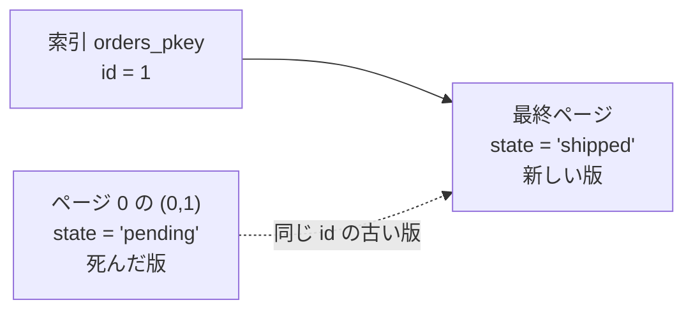
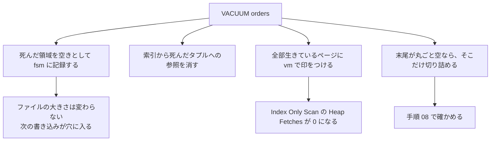

実行ボタンを押すと、この端末のブラウザのなかで Postgres が起動します。サーバーへは何も送りません。

本物の Postgres を WebAssembly にしたものなので、`pg_relation_size` が返すのは実際のファイルの大きさです。SQL は書き換えて再実行できます。

初回は数十秒かかります。以降の手順では同じインスタンスを使い回すので待ちません。

使うのは `orders` テーブル 1 つです。

| 列      | 型          | 中身                           |
| ------- | ----------- | ------------------------------ |
| `id`    | `bigserial` | 主キー                         |
| `state` | `text`      | `paid` と `pending` が半分ずつ |
| `note`  | `text`      | 120 バイトの詰め物             |

全 20,000 行、`analyze` 済みです。`note` が入っているのは、1 行を太らせてページ数を稼ぐためです。行が細いと表より索引のほうが大きくなり、追いかけたいヒープの増減が読めません。

**`VACUUM` は 1 つのフェンスに 1 文だけ書きます。** 複数文は暗黙のトランザクションに包まれ、その中では `VACUUM` が走らないためです。`ANALYZE` や `SET` にこの制限はありません。

## いまの大きさを 3 つの数で測る

Duration: 04:00

Postgres は表を 8 kB のページの列として持ちます。
行はページの中に詰められ、ページが埋まると新しいページが末尾に足されます。

**表の大きさとは、このページの枚数のことです。**
索引は別のファイルなので、別に数えます。

```sql run
select current_setting('block_size') as block_size,
       pg_size_pretty(pg_relation_size('orders')) as heap,
       pg_relation_size('orders') / 8192 as heap_pages,
       pg_size_pretty(pg_indexes_size('orders')) as index,
       count(*) as live_rows,
       round(count(*)::numeric / (pg_relation_size('orders') / 8192), 1) as rows_per_page
from orders;
```

`heap_pages` と `rows_per_page` を覚えておいてください。以降の手順はすべてこの 2 つとの比較です。

1 つのテーブルは 1 つのファイルではありません。
行が入る `main` のほかに、空き容量を記録する `fsm` と、掃除済みのページに印をつける `vm` があります。フォークと呼びます。

```sql run
select pg_relation_size('orders', 'main') / 8192 as main_pages,
       pg_relation_size('orders', 'fsm') as fsm_bytes,
       pg_relation_size('orders', 'vm')  as vm_bytes;
```

**`vm_bytes` が 0 です。** 可視性マップはまだ存在しません。作るのは `VACUUM` です。手順 06 でここへ戻ります。

`'main'` を `'fsm'` や `'vm'` に入れ替えて、どのフォークが何バイトあるか確かめてください。

## UPDATE は行を書き換えない

Duration: 05:00

Postgres の `UPDATE` は、その行があった場所を上書きしません。
**新しい版を別に書き、古い版に「ここまでで死んだ」という印をつけるだけ**です。追記型更新と呼びます。

行がどのページの何番目にいるかは、`ctid` という隠し列で読めます。`(ページ番号, ページ内の位置)` の形です。

まず更新前の位置を控えます。

```sql run
select ctid, id, state from orders where id = 1;
```

ページ 0 の 1 番目、つまり表の先頭です。この行を 1 つ更新します。

```sql run
update orders set state = 'shipped' where id = 1 and state <> 'shipped';

select ctid, id, state, pg_relation_size('orders') / 8192 as heap_pages
from orders where id = 1;
```

**先頭のページから最終ページへ飛びました。**
1 行を書き換えたつもりが、実際には最終ページに 1 行書き足しています。
ページ 0 の元の位置には、誰にも見えない古い版が残ったままです。

`heap_pages` は変わりません。最終ページに空きがあったので、新しいページは要りませんでした。



`and state <> 'shipped'` は、何度押しても同じ状態になるようにするためのものです。
外して 2 回押すと、押すたびに `ctid` が動きます。確かめたら戻してください。

## 1 行も増えないのにファイルが 1.5 倍になる

Duration: 05:00

削除は一度もしません。`pending` の 1 万行を `paid` に変えるだけです。
行数は前後で 20,000 のまま変わりません。

それでもファイルは伸びます。手順 02 で見たことが 1 万回起きるためです。

```sql run
update orders set state = 'paid' where state = 'pending';

select pg_stat_force_next_flush();

select pg_size_pretty(pg_relation_size('orders')) as heap,
       pg_relation_size('orders') / 8192 as heap_pages,
       pg_size_pretty(pg_indexes_size('orders')) as index,
       count(*) as live_rows
from orders;
```

**`live_rows` は 20,000 のままで、ヒープは 1.5 倍近くになりました。**

索引はもっと激しく、ほぼ倍になっています。
**新しい版は新しい索引エントリを要求するためです。** 実務で索引のほうが先に苦しくなる理由がここにあります。

途中の `pg_stat_force_next_flush()` は、この更新の統計をすぐ書き出させるためのものです。次の手順で読みます。

`where state = 'pending'` を `'paid'` に変えないでください。押すたびにファイルが伸び続けます。

## 死んだタプルを数える

Duration: 06:00

増えたページの正体を 3 つの角度から見ます。
統計に出ている死んだタプルの数、生きている行がどのページにいるか、そして読み取りがそれをどう踏むかです。

**死んだタプルとは、まだファイルの中にいるのに、どのトランザクションからも見えなくなった行の版**のことです。

```sql run
select n_live_tup, n_dead_tup,
       round(100.0 * n_dead_tup / (n_live_tup + n_dead_tup), 1) as dead_pct
from pg_stat_user_tables where relname = 'orders';
```

**表の 3 分の 1 が死体です。**
9,999 と 10,000 のどちらになるかは実行のたびに変わります。読み取りのついでに 1 つ掃除されることがあるためです。

この数はフェンスをまたいでしか読めません。統計はいったん溜まり、書き出されるまで 0 のままです。手順 03 の末尾に `pg_stat_force_next_flush()` を置いたのはこのためです。

次に、生きている行の居場所を見ます。

```sql run
select case when (ctid::text::point)[0]::int < 417 then '0-416 : 最初からあったページ'
            else '417-   : 更新で足されたページ' end as region,
       count(*) as live_rows
from orders group by 1 order by 1;
```

`ctid` は専用の型なので、`::text::point` と二段でキャストしてから `[0]` でページ番号を取り出します。

元のページには、生きた行が半分しか残っていません。
**残り半分は死体が占めています。**


最後に、その死体を読み取りが踏むところを見ます。

```sql run
set enable_seqscan = off;

explain (analyze, buffers)
select count(*) from orders where id between 1 and 20000;

reset enable_seqscan;
```

名前は `Index Only Scan` ですが、**`Heap Fetches` が行数を超えています。**
索引だけでは「その行が今も生きているか」を判定できず、ヒープを見に行った回数です。死んだ版の索引エントリも踏んでいます。

`Buffers` は表の全体より桁違いに多くなります。同じページを何十回も読み直しています。

**もう一度押すと `Heap Fetches` が減ります。** 読み取り自体がページを掃除していくためです。桁だけ見てください。

`417` を `310` や `500` に変えて、境目をずらしたときの内訳を見てください。

## VACUUM を走らせる

Duration: 04:00

`VACUUM` は死んだタプルを回収します。
回収とは、そのページの中で「ここは空きだ」と記録し直すことです。

**ファイルを縮めることではありません。** 何が起きて何が起きないかを、数字で確かめます。

```sql run
vacuum orders;
```

このフェンスは列を返さないので、画面には行数だけが出ます。大きさは次で測ります。

```sql run
select pg_size_pretty(pg_relation_size('orders')) as heap,
       pg_relation_size('orders') / 8192 as heap_pages,
       pg_size_pretty(pg_indexes_size('orders')) as index,
       count(*) as live_rows
from orders;
```

**1 バイトも変わっていません。** 手順 03 の出力と同じです。

```sql run
select n_live_tup, n_dead_tup, vacuum_count
from pg_stat_user_tables where relname = 'orders';
```

死んだタプルは 0 になりました。
**死体は消えたのに、ファイルは同じ大きさです。** 空いた場所は、ファイルの内側に穴として残っています。

`vacuum orders;` の後ろに `select 1;` を足して実行してください。
1 フェンス 1 文の制限を、エラーメッセージで一度見ておくと以降ハマりません。

## VACUUM が置いていったもの

Duration: 05:00

`VACUUM` の仕事は領域の回収だけではありません。
**「このページは全部生きている」という印を可視性マップに書き**、索引から死んだタプルへの参照を消します。

手順 01 で 0 だったフォークを見直します。

```sql run
select pg_relation_size('orders', 'main') / 8192 as main_pages,
       pg_relation_size('orders', 'fsm') as fsm_bytes,
       pg_relation_size('orders', 'vm')  as vm_bytes;
```

**`vm_bytes` が 0 から 8192 になりました。** 可視性マップがここで生まれました。

同じ問い合わせを、今度は `set` なしで投げます。

```sql run
explain (analyze, buffers)
select count(*) from orders where id between 1 and 20000;
```

`set enable_seqscan = off;` を書いていないのに `Index Only Scan` が選ばれています。
**`VACUUM` の前は Seq Scan が選ばれていました。** 可視性マップができたことで、索引だけの走査の値段が下がったためです。

`Heap Fetches` は 0。ヒープを 1 ページも読んでいません。
`Buffers` も 2 桁まで落ちます。

**`VACUUM` は掃除であると同時に、読み取りを速くする作業です。**
「ディスクが余っているから `VACUUM` は要らない」という判断は、この差を捨てています。



## 空きが再利用されるのを確かめる

Duration: 04:00

`VACUUM` が作った穴は、次の書き込みが使います。どこに穴があるかは `fsm` フォークが覚えています。

もう 1 万行を更新します。手順 03 とほぼ同じ量です。
手順 03 では 200 ページ以上増えました。今度はどうなるかを見ます。

```sql run
update orders set state = 'closed' where state = 'paid' and id <= 10000;

select pg_size_pretty(pg_relation_size('orders')) as heap,
       pg_relation_size('orders') / 8192 as heap_pages,
       count(*) filter (where state = 'closed') as closed_rows,
       count(*) as live_rows
from orders;
```

**1 万行を更新して、ページは 1 枚も増えていません。**
同じ量の仕事が、ファイルを伸ばさずに済みました。これが `VACUUM` で買ったものです。

**肥大化とは、増えたまま戻らないことではありません。**
空きが作られる速さより、消費される速さが上回り続けることです。

`id <= 10000` を `id <= 20000` に変えて押してください。空きが足りなくなり、ページが増えます。確かめたら手順 05 の `vacuum orders;` を押して戻してください。

## 縮む DELETE と縮まない DELETE

Duration: 06:00

`VACUUM` はファイルを縮めない、と手順 05 で見ました。
**これは半分だけ正しい言い方です。**

`VACUUM` は末尾のページが丸ごと空になっていれば、そこを切り詰めます。
切り詰められないのは、空きがファイルの途中に散らばっているときです。

同じ 2 万行の表を 2 つ作り、同じ 1 万行を、片方は後ろ半分から、片方は 1 行おきに消して比べます。

```sql run
drop table if exists tail_demo;
drop table if exists gap_demo;

create table tail_demo (id bigint primary key, note text not null);
create table gap_demo  (id bigint primary key, note text not null);

insert into tail_demo select g, repeat('x', 120) from generate_series(1, 20000) g;
insert into gap_demo  select g, repeat('x', 120) from generate_series(1, 20000) g;

delete from tail_demo where id > 10000;
delete from gap_demo  where id % 2 = 1;

select pg_relation_size('tail_demo') / 8192 as tail_pages,
       pg_relation_size('gap_demo')  / 8192 as gap_pages,
       (select count(*) from tail_demo) as tail_rows,
       (select count(*) from gap_demo)  as gap_rows;
```

ここまでは同じです。行数もページ数も揃っています。
**違うのは死体の置き場所だけです。**

```sql run
vacuum tail_demo;
```

```sql run
vacuum gap_demo;
```

```sql run
select pg_relation_size('tail_demo') / 8192 as tail_pages,
       pg_relation_size('gap_demo')  / 8192 as gap_pages;
```

**後ろからまとめて消したほうは半分になりました。**
1 行おきに消したほうは 1 ページも減っていません。

`VACUUM` がファイルを切り詰められるのは、**末尾から連続して空になっている部分だけ**です。
途中に 1 行でも生きた行があれば、そこから先は動かせません。行の物理的な位置は `ctid` として索引に記録されているので、勝手に前へ詰められないためです。


「`VACUUM` は OS に領域を返さない」という言い方は、正確には **「返せるのは末尾だけ」** です。
古いパーティションを丸ごと落とす運用が効くのは、これが理由です。

`delete from gap_demo where id % 2 = 1;` に `and id < 19000` を足して、末尾 1,000 行だけを生かしてみてください。切り詰めがどこで止まるかが分かります。

## VACUUM FULL で本当に縮める

Duration: 04:00

ファイルを縮める道具は `VACUUM FULL` です。
**同じファイルを掃除するのではなく、生きている行だけを新しいファイルへ書き直します。**

そのぶん、表全体を排他ロックし、書き直す間は元と新の 2 つぶんの容量を要求します。
稼働中のデータベースで気軽に打つものではありません。

```sql run
vacuum full orders;
```

```sql run
select pg_size_pretty(pg_relation_size('orders')) as heap,
       pg_relation_size('orders') / 8192 as heap_pages,
       pg_size_pretty(pg_indexes_size('orders')) as index,
       count(*) as live_rows
from orders;
```

ヒープが縮み、索引も元の大きさへ戻りました。
索引がここで初めて縮んだことに注目してください。**`VACUUM FULL` は索引を作り直します。**

**手順 01 のページ数より小さくなっています。**
最初のテーブルは `INSERT` の途中でページに端数の空きを残していました。`VACUUM FULL` はそれも詰め直します。

手順 06 の `EXPLAIN` へ戻って押してください。`Heap Fetches` がどうなるか予想してから確かめると、`VACUUM FULL` が可視性マップに何をしたかが分かります。

## 肥大化を起こさない更新にする

Duration: 06:00

ここまでは起きた肥大化を掃除する話でした。起こさない側の手を 1 つ試します。

新しい版が**同じページに収まり、かつ索引の付いた列を変えていない**とき、Postgres は索引を触らずにページ内で版をつなぎます。HOT 更新と呼びます。

`fillfactor` はページをどこまで埋めるかの設定です。
下げると最初から大きくなる代わりに、更新のための余白が各ページに残ります。

```sql run
drop table if exists ff100;
drop table if exists ff70;

create table ff100 (id bigint primary key, state text not null, note text not null);
create table ff70  (id bigint primary key, state text not null, note text not null)
  with (fillfactor = 70);

insert into ff100 select g, 'v0', repeat('x', 120) from generate_series(1, 20000) g;
insert into ff70  select g, 'v0', repeat('x', 120) from generate_series(1, 20000) g;

select pg_relation_size('ff100') / 8192 as ff100_pages,
       pg_relation_size('ff70')  / 8192 as ff70_pages;
```

**`fillfactor = 70` は初手で 4 割ほど大きいです。** これが払う代金です。

ここから、全体の 10% にあたる 2,000 行を 2 回更新します。

```sql run
update ff100 set state = 'v1' where id % 10 = 0 and state = 'v0';
update ff70  set state = 'v1' where id % 10 = 0 and state = 'v0';

select pg_relation_size('ff100') / 8192 as ff100_pages,
       pg_relation_size('ff70')  / 8192 as ff70_pages;
```

```sql run
update ff100 set state = 'v2' where id % 10 = 0 and state = 'v1';
update ff70  set state = 'v2' where id % 10 = 0 and state = 'v1';

select pg_stat_force_next_flush();

select pg_relation_size('ff100') / 8192 as ff100_pages,
       pg_relation_size('ff70')  / 8192 as ff70_pages;
```

既定側は 1 回ごとに伸びています。**70 側は 1 枚も増えていません。**

```sql run
select relname, n_tup_upd, n_tup_hot_upd
from pg_stat_user_tables where relname in ('ff100', 'ff70') order by relname;
```

**`n_tup_hot_upd` を見てください。**
同じ回数の更新が、片方では全部ページ内で済み、片方ではほぼ全部が新しいページを要求しました。

`n_tup_hot_upd / n_tup_upd` は、更新の多い表を疑うときに最初に見る比です。

ただし万能ではありません。
**全行を一度に更新すると `fillfactor = 70` でも伸びます。** 1 ページの余白は十数行ぶんしかないので、全部を同時に更新すれば溢れます。効くのは「一部の行が繰り返し更新される」形のときです。

`id % 10 = 0` を `id % 2 = 0` に変えて、`ff70` も伸び始める点を探してください。

## まとめ

Duration: 03:00

肥大化は削除で起きるものではありません。**更新で起きます。**
そして掃除の道具は 3 つあり、値段が違います。

| 見る場所                                        | 何を疑うか                       | 打つ手                                       |
| ----------------------------------------------- | -------------------------------- | -------------------------------------------- |
| `n_dead_tup` の割合                             | 掃除が追いついていない           | `VACUUM`。追いつかないなら autovacuum を調整 |
| `n_tup_hot_upd / n_tup_upd` が低い              | 更新のたびに新しいページを要求   | `fillfactor` を下げる。索引を見直す          |
| `Index Only Scan` の `Heap Fetches` が 0 でない | 可視性マップの印が落ちている     | `VACUUM`                                     |
| 行が減ったのにファイルが縮まない                | 空きがファイルの途中に散っている | `VACUUM FULL` (排他ロックと 2 倍の容量)      |
| 古いデータをまとめて消す運用                    | 途中に穴を空けている             | 末尾から消す。パーティションごと落とす       |

この端末では再現できないものが 1 つあります。
**開きっぱなしのトランザクションは `VACUUM` の回収を止めます。** 誰かがまだそのタプルを見ているかもしれない以上、消せないためです。

実務で「`VACUUM` を回しているのに `n_dead_tup` が減らない」ときは、まず `pg_stat_activity` の長寿命トランザクションを疑ってください。
この演習環境は接続が 1 本しかないため、その状態を作れません。
