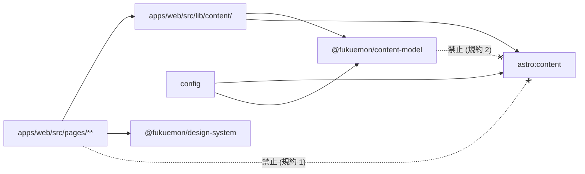

# Codebase Architecture

本 repo の package 境界と依存規約を定める。
判断の理由は ADR、全体像は [design/DesignDoc.md](../design/DesignDoc.md) を参照する。

## Package Boundary

```text
fukuemon.dev/
├── apps/
│   └── web/                          # Astro 7
│       ├── src/
│       │   ├── pages/                # URL の写し。Astro が予約する唯一のディレクトリ
│       │   ├── layouts/              # ページの外枠
│       │   ├── features/             # セクションごとの部品。lab/ listing/ doc/ about/ search/
│       │   ├── components/           # セクションをまたぐ素の部品。.astro と .tsx を同居させる
│       │   ├── lib/content/          # astro:content ↔ content-model のアダプタ
│       │   ├── content/             # articles/ labs/ playgrounds/
│       │   ├── data/                 # 書いている人の正本 (about が読む)
│       │   ├── content.config.ts     # loader と schema の結線 (データソースの差し替え点)
│       │   └── styles/               # global.css が site.css / motion.css を束ねる
│       ├── public/                   # そのまま配る。avatar.webp / favicon.svg / _headers (未作成)
│       ├── astro.config.ts
│       └── wrangler.jsonc
├── packages/
│   ├── config/                       # tsconfig の共有設定
│   ├── content-model/                # schema / ContentRef / 関係グラフ (Astro 非依存)
│   └── design-system/                # tokens.css / utilities.css / art / code-theme.ts
├── infra/                            # Terraform。workspace package ではない
├── e2e/                              # E2E。全体に関わるためルート直下
├── design/ context/ specs/ adr/
├── pnpm-workspace.yaml               # apps/* packages/*
├── vite.config.ts                    # Vite+ の task graph (依存関係のみ)
└── package.json
```

### ディレクトリの軸

**共有度で分けない。** 共有度は増えるほど片側に寄り、一方が残余のバケツになる。
軸は「そのディレクトリが答える問い」とする。

| ディレクトリ  | 答える問い                       | 増え方                     |
| ------------- | -------------------------------- | -------------------------- |
| `pages/`      | この URL は何か                  | 画面が増えたら 1 ファイル  |
| `layouts/`    | このページの外枠は何か           | セクションが増えたときだけ |
| `features/`   | このセクションは何をする所か     | セクションが増えたときだけ |
| `components/` | セクションをまたぐ素の部品は何か | ほぼ増えない               |
| `data/`       | 書いている人の情報はどこにあるか | 増えない                   |
| `lib/`        | このデータはどこから来るか       | ほぼ増えない               |

**`components/` を最初から分類しない。割るのは増えてからにする。**
45 ファイルになった時点で割った。分類のコストが検索のコストを下回るのは、
フラットに並べて目で追えなくなってからである。

`features/` の中も同じ軸で割る。

| feature    | 中身                                 |
| ---------- | ------------------------------------ |
| `lab/`     | ハンズオンと playground の実行まわり |
| `listing/` | 一覧の行・表・タブ・関連             |
| `doc/`     | 本文のサイドバー。目次とほかの記事   |
| `about/`   | トップの表紙                         |
| `search/`  | 本文の検索                           |

`lab/` はさらに 6 つの問いで割る。

| ディレクトリ | 答える問い           |
| ------------ | -------------------- |
| `runtime/`   | どこで動くか         |
| `editor/`    | どう書くか           |
| `panel/`     | どう実行するか       |
| `catalog/`   | いま何が入っているか |
| `steps/`     | どこまで進んだか     |
| `local/`     | 手元でどう組むか     |

`bus.ts` は 3 つの島がまたぐので `lab/` の直下に置く。

**`components/` に残すのは、セクションをまたぐ素の部品だけにする。**
`Icon` / `Tate` / `ArtBand` / `SiteHeader` / `SiteFooter` の 5 つである。
どれか 1 つの feature でしか使わなくなったら、その feature へ移す。

**`.astro` と `.tsx` を同居させる。**
技術で分けない。
どちらが JavaScript を配るかは拡張子と `client:*` が示しており、ディレクトリは情報を足さない。
Astro の公式ドキュメントも、UI framework のコンポーネントを `src/components/` に置くとしている。

`layouts/` の中身は次のとおり。

| layout          | 用途                                             |
| --------------- | ------------------------------------------------ |
| `SiteLayout`    | ヘッダとフッタを持つ。トップ / 一覧 / playground |
| `DocShell`      | 本文の外枠 (パンくず・題・meta・関連)。記事      |
| `ArticleLayout` | `SiteLayout` + サイドバー + `DocShell`           |
| `LabLayout`     | `SiteLayout` + サイドバー + 1 画面 1 手順の面    |
| `PostsLayout`   | `SiteLayout` + 一覧の外枠                        |

**記事とハンズオンで layout を分ける。** サイドバーの中身 (目次 / 手順) と本文の出し方 (通し / 1 画面 1 手順) が違う。
1 つにまとめると `if` が増える。
**版面とサイドバーの見た目は共通の class (`.g-doc` / `.side`) で揃える。**

### Island の規約

対象は `apps/web/src/{features,components}/**/*.{tsx,jsx,vue}`。

- **Astro を import しない。**
  `astro:content` も `.astro` も参照しない
- 素の props だけを受ける。
  データの取得は `pages/` か `layouts/` が行う
- テストを隣に置く

**検査**: Oxlint の `no-restricted-imports`。
対象を拡張子で指定し、`astro:content` を `paths`、`*.astro` を `patterns` で禁じる。

**フレームワークは 1 つに絞る。**
hydrate するページは、そのフレームワークのランタイムを配る。
React と Vue を同じページに混ぜると両方を配ることになる。

### 命名

「何の + 動作 + UI 要素」の順で組む。

- `ContentTable` / `KindTabs` / `LabStepList` / `ArtBand`
- 状態の接尾辞を先頭へ置かない。`ActiveTab` ではなく `TabActive` でもなく、状態は props で表す

| package                   | 責務                                                                 | 依存してよい先 |
| ------------------------- | -------------------------------------------------------------------- | -------------- |
| `@fukuemon/config`        | tsconfig の共有設定。oxlint と vitest はルートで 1 つ持つ            | なし           |
| `@fukuemon/content-model` | Content Model の zod schema、`ContentRef` 型、関係グラフの構築と検証 | `zod` のみ     |
| `@fukuemon/design-system` | Design Tokens (素の CSS)、版面のユーティリティ、挿絵、コードの配色   | なし           |
| `apps/web`                | Astro アプリ。全画面の描画                                           | 上記 3 package |
| `infra/`                  | Terraform                                                            | なし           |

### package を増やす条件

次のどちらかが成立したときに切り出す。

| 条件                         | 根拠                   |
| ---------------------------- | ---------------------- |
| 2 つ以上の消費者が実在する   | 共有                   |
| 消費側と**別の理由で変わる** | 独立したライフサイクル |

**共有だけを条件にしない。**
消費者が 1 つでも、自分の版・自分のテスト・自分の理由で変わるものは package にする。
消費側の都合で壊れないことが、その境界の価値である。

逆に、消費者が 1 つで変わる理由も消費側と同じなら切り出さない。
`ContentTable` / `KindTabs` / ハンズオンの `StepList` がこれに当たる。
いずれもこのサイトの画面のために変わる。

`tokens.css` と `code-theme.ts` は Expressive Code の `styleOverrides` からも参照するため `packages/design-system` に置く。

### `infra/` を `packages/` に入れない

`packages/` は app から import される共有ライブラリの場所であり、infra はどこからも import されない。`pnpm-workspace.yaml` の glob からも外れる。
実行は root script から行う (`pnpm infra:plan` 等)。

### Portfolio を別 app に切り出さない

中核価値である記事とハンズオンの地続きは、両者を 1 つの一覧に載せて初めて成立する。
app を分けると一覧が分かれる。

**分ける条件**: 別ドメインで公開する必要が生じたとき、または Portfolio と Content のデプロイ頻度が分かれて相互に待たされるようになったとき。

## 依存規約

**この 2 本が、描画レイヤの差し替えとデータソースの移行を成立させる。** 理由は [ADR-0002](../adr/0002-content-model-independence.md)。

### 規約 1 — ページから `astro:content` を直接 import しない

`apps/web/src/pages/**` / `features/**` / `components/**` / `layouts/**` は、コンテンツへの参照を必ず `apps/web/src/lib/content/` の公開関数経由で行う。

```
listContent() / getContent() / getRelated()
```

**検査**: Oxlint の `no-restricted-imports`。

### 規約 3 — Island は Astro を import しない

対象は `apps/web/src/{features,components}/**/*.{tsx,jsx,vue}`。
`astro` / `astro:content` / `.astro` ファイルのいずれも参照しない。
必要な値は props で受ける。

**検査**: Oxlint の `no-restricted-imports`。

### 規約 2 — `@fukuemon/content-model` は Astro に依存しない

`astro` / `astro:content` を `dependencies` にも `devDependencies` にも入れない。`astro:content` から取得したエントリは引数で受け取る。

**検査**: package の依存宣言と `knip`。

### 依存の向き



### 変更の局所性

| 変更                               | 変更範囲                               |
| ---------------------------------- | -------------------------------------- |
| 本文の描画レイヤを差し替え         | `layouts/{Article,Lab}Layout.astro`    |
| データソースの移行 (Markdown → 別) | `content.config.ts` の loader          |
| Astro のメジャーアップグレード     | `apps/web/src/lib/content/` のアダプタ |

## Runtime Boundary

- **実行時のサーバーコンポーネントを持たない。** すべてビルド時に解決する。
  Worker はハンドラを持たず静的アセットの配信のみを行う ([ADR-0005](../adr/0005-workers-terraform-wrangler-boundary.md))。
- React は Astro Islands として局所適用に限る。**静的 HTML で表現できるものに React を使わない。** Island の追加は「静的では不可能」を根拠にする。
- Expressive Code が挿す CSS はこちらのビルドを通らない。
  共有できるのは素の CSS カスタムプロパティのみ。
  規則も cascade layer に属さないため、上書きするときは layer の外に置く。

## State Boundary

- **サーバー側の永続状態を持たない。** 読者の identity を前提とする機能を作らない ([ADR-0008](../adr/0008-no-reader-identity.md))。
- クライアント側の状態は `localStorage` に限る (ハンズオンの進捗のみ)。
  キーは `contentId` + 手順 index。
- 訪問済みの表現は CSS の `:visited` に委ねる。

## URL 規約

サイトは about / blog / playground の 3 つのセクションである ([ADR-0009](../adr/0009-site-sections-and-playground-collection.md))。

| URL                           | 実装                                                              |
| ----------------------------- | ----------------------------------------------------------------- |
| `/`                           | `src/pages/index.astro` (about をまとめる)                        |
| `/blog`                       | `src/pages/blog/index.astro`                                      |
| `/blog/articles` `/blog/labs` | `src/pages/blog/[kind].astro`                                     |
| `/articles/<path>`            | `src/pages/articles/[...slug].astro`                              |
| `/labs/<path>`                | `src/pages/labs/[...slug].astro`                                  |
| `/playground`                 | `src/pages/playground/index.astro`                                |
| `/playground/<id>`            | `src/pages/playground/[...slug].astro`。isolation を予約 (未適用) |
| `/api/*`                      | **予約**。条件が成立するまで使わない                              |

### 規約

- **`/docs/` 配下に入れない。** 描画の実装詳細を URL に露出しない。
  差し替えても URL が変わらない。
- **`src/content/` の配置と URL を一致させない。** ディレクトリは `content/{articles,labs,playgrounds}/`、URL は `/articles/<path>`、`/labs/<path>`、`/playground/<id>`。
  ルーティングは `pages/` 側の動的ルートが担う。
- **一覧の名前 (`/blog`) と本文の置き場 (`/articles` `/labs`) を揃えない。** 揃えると `/blog/articles` が一覧と本文の両方を指す。
- **コンテンツの `path` に `api` と `playground` を使わない。**
- 404 は `src/pages/404.astro` に置く。

## 参照

- [design/DesignDoc.md](../design/DesignDoc.md): 全体像とモジュール責務
- [ADR-0002](../adr/0002-content-model-independence.md): 依存規約の理由
- [ADR-0003](../adr/0003-monorepo-and-vite-plus.md): monorepo の理由
- [ADR-0001](../adr/0001-starlight-as-docs-renderer.md): 描画レイヤの決定と URL 規約
- [context/authoring.md](authoring.md): 記事とハンズオンの書き方
- [ADR-0006](../adr/0006-interactive-content-levels.md): `/playground/*` と `/api/*` の予約
- [context/toolchain.md](toolchain.md): 依存規約の検査手段
