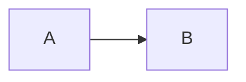

# Authoring

記事とハンズオンを 1 本足す手順を定める。
**追加で触るファイルは Markdown 1 枚だけにする** (成功条件 S3)。

## 置き場

| 種別       | 置き場                           | URL                |
| ---------- | -------------------------------- | ------------------ |
| 記事       | `apps/web/src/content/articles/` | `/articles/<file>` |
| ハンズオン | `apps/web/src/content/labs/`     | `/labs/<file>`     |

ディレクトリが種別を決める。
frontmatter に種別を書かない。

## 記事

拡張子は `.md`。
**実行パネルを置くなら `.mdx`。** `remark-lab` は拡張子だけを見るので、記事にも同じフェンスが使える。
ただし記事は `setup` を持てないので、フェンスの中で必要なものを作りきる。

```yaml
---
contentId: index-not-used # 発行後は変えない。^[a-z0-9][a-z0-9-]*$
title: インデックスが使われないときに見る 3 箇所
description: 統計情報、型の暗黙変換、選択率。この順で疑う。
tags: [postgres] # 1 つ以上。索引ページは持たない
status: published # draft のあいだは dev でだけ見える
publishedAt: 2026-05-18
related: [rdbms-query-execution] # 相手の contentId。片方向でよい
---
```

**`related` は片方向だけ書く。** 逆向きはビルド時に導出する。
両方に書くと片側の書き忘れで不整合が出る。

**存在しない `contentId` を書くとビルドが失敗する。**
静的サイトでは「関連が出ない」形で静かに壊れ、目視で気づけないため。

`h2` が目次になる。
罫の長さはその章の本文量から出すので、著者は何も指定しない。

## ハンズオン

手を動かす場所を `interactive.level` で選ぶ。
**level がページに置くものを決める。**

| `level`    | 手を動かす場所    | ページに出るもの   | 拡張子 |
| ---------- | ----------------- | ------------------ | ------ |
| `embedded` | ページの中 (WASM) | 実行パネル         | `.mdx` |
| `local`    | 読者の端末        | clone と起動の手順 | `.md`  |

`sandbox` (WebContainers / WebVM) は [ADR-0006](../adr/0006-interactive-content-levels.md) で設計だけ決めてある。
**schema は受け付けない。** 実装するときに足す。

`local` は実行パネルを持たないので JSX を差し込まない。
`.md` で書けて、ページには JavaScript を 1 バイトも配らない。

### 手順 (level に共通)

`h2` が手順の境界になる。
**1 つの `h2` が 1 画面**になり、サイドバーと前後ボタンで切り替わる。
最初の `h2` より前に本文を書くと、それが「はじめに」の画面になる。

**手順数を frontmatter に書かない。** 本文と乖離するため。

見出しの直後に所要時間を書ける。
この行は本文には出ない。

```markdown
## 実行計画を見る

Duration: 05:00
```

### embedded — ページの中で動かす

拡張子は `.mdx`。
実行パネルを差し込むため MDX を使う。

```yaml
---
contentId: rdbms-query-execution
title: RDBMS のクエリ実行を理解する
description: 見積もりと実測がずれる状況を自分で作ります。
tags: [postgres]
status: published
publishedAt: 2026-08-21
difficulty: intermediate # beginner | intermediate | advanced
duration: 60 # 分
interactive:
  level: embedded
  runtime: pglite
setup: | # 実行パネルが最初に 1 度だけ流す
  create table events (id bigserial primary key, kind text not null);
  insert into events (kind) select 'view' from generate_series(1, 50000);
  analyze events;
related: []
---
```

#### 実行パネル

コードフェンスに `run` を付けると、実行パネルになる。

````markdown
```sql run
explain
select kind, count(*) from events group by kind;
```
````

**著者が書くのはこれだけである。**
手順の番号・題・総数・`contentId` は本文から数えて埋める。
JSX を書く必要はない。

`run` を付けないフェンスは、色付きのコードとして出る。
**`.md` に `run` を書くとビルドが失敗する。** MDX でなければ JSX を差し込めないためである。

複数の文を書ける。
**列を返した最後の文の結果を表に出す。** 前置きの `insert` や `analyze` ではなく、確かめたい文が出る。

**ただし `VACUUM` は 1 文だけで書く。**
複数文は暗黙のトランザクションに包まれ、`VACUUM cannot run inside a transaction block` で失敗する。
`CREATE DATABASE` と `CREATE INDEX CONCURRENTLY` も同じである。

```sql run
insert into events (kind) select 'purchase' from generate_series(1, 30000);

explain analyze
select * from events where kind = 'purchase';
```

#### 実行環境の性質

- 実行環境は**押されるまで落とさない**。ページを開いただけでは 1 バイトも配らない
- 押すと 4 ファイル・**gzip 5.28 MiB / brotli 4.45 MiB** をダウンロードする (2026-08-30 実測)
- 1 ページで **1 インスタンスを共有する**。2 つ目以降の実行は 1 秒未満で返る
- 保存先は**メモリ**。再読み込みで初期状態に戻る
- 初回は Fast 4G で **20〜25 秒**。Slow 4G は 60 秒の上限に当たって失敗しうる (実測 73 秒)。
  再試行すればキャッシュから 10 秒台で立ち上がる
- 実行が成功すると、その手順が完了になる
- 結果は**先頭 200 行**だけを出す。全部描くとページが動かなくなる
- `drop table` などで壊したら「初めから」を押す。`setup` が流し直される
- **実行中は「中断」が出る。** Worker を終了させて止めるので、重いクエリでも画面は固まらない
- **最初の `h2` より前に置いたパネルは、どの手順も完了にしない**
- サイドバーの「いまのテーブル」は、1 度実行するまで出ない。
  行を押すと先頭 20 行が別窓で開く

#### 実行環境を変える

`interactive.runtime` で選ぶ。パネルに出る表示名が切り替わる。

| `runtime` | 表示名   | 状態 |
| --------- | -------- | ---- |
| `pglite`  | Postgres | 済   |

**実装済みの値だけを schema が受け付ける。**
先回りして受理すると、ビルドを通ったコンテンツが読者の押下で初めて失敗する。
足す手順は「実行環境を足す」に書く。

足す手順は「実行環境を足す」に書く。

### local — 読者の端末で動かす

ポートを開く、プロセスを分ける、ホストのリソースを使う。
これらはブラウザの中で再現できないので、リポジトリを渡して手元で組んでもらう。

拡張子は `.md` でよい。
JSX を差し込まないので MDX は要らない。

```yaml
---
contentId: <slug>
title: <題>
description: <一覧に出る 1 行>
tags: [<分類>]
status: published
publishedAt: 2026-08-30
difficulty: intermediate
duration: 45
interactive:
  level: local
  repository: https://github.com/<owner>/<repo>
  via: devcontainer # devcontainer | docker-compose | manual
  requires:
    - name: Docker
      check: docker --version
    - name: VS Code と Dev Containers 拡張
      check: code --list-extensions | grep ms-vscode-remote.remote-containers
related: []
---
```

本文の前に「手元で用意する」の節が自動で入る。
`requires` の各行、`git clone`、`via` に応じた起動コマンドが、コピーボタン付きで並ぶ。

`via` が起動コマンドを決める。

| `via`            | 出るもの                               |
| ---------------- | -------------------------------------- |
| `devcontainer`   | `code .` と Reopen in Container の案内 |
| `docker-compose` | `docker compose up -d`                 |
| `manual`         | README を読む案内                      |

サイドバーには手順の一覧だけが出る。
実行が起きないので、完了の印は通り過ぎた手順にだけ付く。

## 図

コードフェンスに `mermaid` と書くと図になる。
**記事にもハンズオンにも置ける。**

````markdown

````

- **ビルド時に SVG へ変換する。** ページに mermaid 本体 (約 300 KiB) を配らない
- 色はサイトのトークンへ置き換わる。明暗どちらの地でも 1 枚の SVG が成立する
- 図 4 枚で gzip 6.1 KiB (2026-08-30 実測)
- 書体は本文と同じ

**色を自分で指定しない。** `style` や `classDef` で色を書くと、暗い地で読めなくなる。

`run` を付けると playground になる。

````markdown

````

こちらはクライアントで描くので mermaid 本体を配る。
**まだ実装していない。**

## 実行環境を足す

### embedded に engine を足す

触る表は 2 つある。

1. `apps/web/src/components/lab/pglite.worker.ts` と同じ `boot` / `exec` を持つ Worker を書く
2. `runtime.ts` の `WORKERS` に 1 行足す

```ts
const WORKERS = {
  pglite: () => new Worker(new URL("./pglite.worker.ts", import.meta.url), { type: "module" }),
  duckdb: () => new Worker(new URL("./duckdb.worker.ts", import.meta.url), { type: "module" }),
} satisfies Record<string, () => Worker>;
```

Vite は `new URL(..., import.meta.url)` を静的に解決するため、パスを変数にできない。
そのため表に literal で並べる。

**結果が表の形なら、ここで終わる。**
`interactive.runtime` に `duckdb` と書けば `SqlRunner` がそのまま動く。

結果が表の形でない場合 (端末の出力など) は、部品も足す。

3. `SqlRunner.tsx` と同じ props を取る部品を書く
4. `apps/web/src/lib/remark-lab.ts` の `RUNNERS` に 1 行足す

```ts
const RUNNERS: Record<string, Runner> = {
  sql: {
    name: "SqlRunner",
    path: "~/components/lab/SqlRunner",
    engine: "Postgres",
    kind: "pglite",
  },
  py: { name: "PyRunner", path: "~/components/lab/PyRunner", engine: "Python", kind: "pyodide" },
};
```

フェンスの言語が引き当てるキーになる。
`py` を足せば ` ```py run ` が使えるようになる。

**どちらの場合もコンテンツ側の書き方は変わらない。**
著者は frontmatter の `runtime` か、フェンスの言語を変えるだけである。

### sandbox を足す

WebContainers / WebVM を使うときは、まず schema に `sandbox` の枝を戻す。
そのうえで `/playground/[id].astro` を作り、iframe を出す。
`SqlRunner` の系統は触らない。
結果の形が違う (端末の出力、プレビューの URL) ので、表を出す部品を再利用しない。

## 確認

```sh
pnpm --filter @fukuemon/web dev     # draft も見える
pnpm --filter @fukuemon/web build   # published だけを書き出す
```

## 参照

- [design/features/content-model/DesignDoc_content-model.md](../design/features/content-model/DesignDoc_content-model.md): schema と相互参照
- [design/features/interactive/DesignDoc_interactive.md](../design/features/interactive/DesignDoc_interactive.md): 実行環境の段階
- [context/architecture.md](architecture.md): URL 規約
