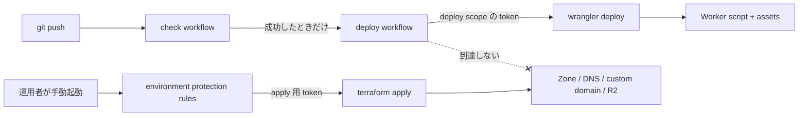

# Infrastructure & Operations

Cloudflare リソースの管轄と運用手順。
判断の理由は [ADR-0005](../adr/0005-workers-terraform-wrangler-boundary.md)。

## Infrastructure / Deployment

**Cloudflare Workers Static Assets で配信する。** Worker はハンドラを持たず、静的アセットの配信のみを行う。



設定ファイルは **`wrangler.jsonc`** を使う。
Cloudflare は新規プロジェクトへ JSONC を推奨しており、一部の新機能は JSON 形式でのみ使える。

### deploy 経路

| 項目          | 値                                                        |
| ------------- | --------------------------------------------------------- |
| Worker 名     | `fukuemon-dev`                                            |
| 契機          | Check workflow が既定ブランチで成功したとき               |
| workflow      | `.github/workflows/deploy.yml`                            |
| wrangler 設定 | `apps/web/wrangler.jsonc`                                 |
| 配信元        | `apps/web/dist` (Astro の build 成果物 + pagefind の索引) |
| 必要な secret | `CLOUDFLARE_API_TOKEN` / `CLOUDFLARE_ACCOUNT_ID`          |

**custom domain はまだ無い。** `infra/cloudflare/` を apply していないため、到達先は `workers.dev` のサブドメインである。
ドメインは Cloudflare Registrar で取得済みであり、zone も存在する。

## Infrastructure Contract (Terraform / Wrangler 管轄表)

> **基盤設定を Terraform、アプリの deploy と runtime 設定を Wrangler が管理する。1 つのリソースを両方から管理しない。**

**このファイルが管轄の運用上の正本である。** リソースが増減したらこの表を更新する。

| リソース                                                   | 管轄                           | 状態     |
| ---------------------------------------------------------- | ------------------------------ | -------- |
| Zone / DNS record / TLS                                    | Terraform                      | 使う     |
| Workers custom domain (`cloudflare_workers_custom_domain`) | Terraform                      | 使う     |
| R2 バケット (Terraform state 用)                           | Terraform (`infra/bootstrap/`) | 使う     |
| Worker script + static assets                              | Wrangler                       | 使う     |
| deployment                                                 | Wrangler                       | 使う     |
| レスポンスヘッダ (`_headers`)                              | Wrangler (配信物の一部)        | 使う     |
| runtime secret                                             | Wrangler                       | 該当なし |
| binding (D1 / KV / R2)                                     | Wrangler (`wrangler.jsonc`)    | 該当なし |
| D1 / KV / R2 (データ本体)                                  | Terraform                      | 該当なし |

### 管轄が判断できない新規リソースの判定順序

1. **データを保持するか。
   保持するなら Terraform。** 消えると復旧できないリソースを、deploy のたびに動く経路から切り離す
2. deploy のたびに変わるか。
   変わるなら Wrangler
3. 変わらない場合、その変更が本番の可用性またはドメイン到達性に影響するか。
   影響するなら Terraform
4. どちらでもない場合、Terraform を既定とする (変更履歴と review を残せるため)

### `cloudflare_workers_script` を使わない

provider 5.11.0 以降は `assets = { directory = ... }` で静的アセットを Terraform から配れるが、**使うと deploy が Terraform 経由になり apply 権限が日常の CI へ降りる。**

### 値の受け渡し

Terraform が作ったリソースの識別子 (R2 のバケット名、D1 の database id) を Wrangler へ渡す必要がある。**現時点で該当するリソースは無い。** データを保持するリソースが 2 つ目になる前に、受け渡しの方法をこのファイルに定める。

## ディレクトリ構成

```text
infra/
├── README.md        # apply 手順 / bootstrap の順序 / 権限
├── bootstrap/       # state 置き場の R2 バケット。初回 1 回。state はローカルで commit しない
│   ├── provider.tf
│   ├── r2_state_bucket.tf
│   └── vars.tf
└── cloudflare/      # 本体
    ├── provider.tf  # terraform{} + backend (R2) + provider
    ├── vars.tf
    ├── zone.tf
    └── workers_domain.tf
```

- ファイル命名は `provider.tf` / `<subject>.tf` / `vars.tf` の 3 種に揃える (Cloudflare Terraform Best Practices)。
- **DNS レコードの `.tf` を置かない。** `cloudflare_workers_custom_domain` が apex のレコードを自動で管理するため、手書きのレコードは衝突する。
  custom domain が管理しないレコード (MX / TXT 等) が要るまで `dns.tf` を作らない。
- **`modules/` を作らない。** 対象が 1 アカウント / 1 zone / 1 サイトで括り出す重複がない。
  同じ形が 2 箇所以上に実在するまで作らない。
- **環境をディレクトリで分けない。** staging を持たない。
- **`infra/` は workspace package ではない。** 実行は root script から行う。

## bootstrap 順序

`cloudflare_workers_custom_domain` は Worker の存在を前提とする。**順序を誤ると 3 が失敗する。**

1. `infra/bootstrap/` を apply — state 用 R2 バケットを作る (state はローカル。
   commit しない。
   失った場合は `terraform import` で回復する)
2. `wrangler deploy` — Worker script + assets を作る。**Pages と異なり事前の手動作成は不要である**
3. `infra/cloudflare/` で zone を import してから apply — custom domain を作る (state は R2 backend)

**zone は Terraform で作らない。** ドメインを Cloudflare Registrar で取得しており、zone は取得時に作られている。
`zone.tf` の `import` ブロックが apply のたびに state へ取り込むため、手動の `terraform import` は要らない。
ネームサーバも既に Cloudflare を向いているため、レジストラ側の設定は要らない。

## state backend

R2 は S3 互換だが AWS ではない。`s3` backend は STS / IAM / metadata API を前提にする箇所があるため検証を切る。

```hcl
backend "s3" {
  bucket = "<state バケット名>"
  key    = "cloudflare/main/terraform.tfstate"
  region = "auto"
  endpoints = { s3 = "https://<ACCOUNT_ID>.r2.cloudflarestorage.com" }

  skip_credentials_validation = true # STS が無い
  skip_region_validation      = true # auto は AWS のリージョン名でない
  skip_requesting_account_id  = true # IAM / STS / metadata API が無い
  skip_s3_checksum            = true # R2 のチェックサム対応が限定的
  use_path_style              = true
  use_lockfile                = true # state ロックを S3 側のオブジェクトで取る
}
```

**state の key に scope を含める** (`cloudflare/main/terraform.tfstate`)。
後から兄弟の state を足すとき、既存 state のリネームを避けられる。

**バケットのバージョニングは設定しない。** provider 5.24.0 の `cloudflare_r2_bucket` に versioning 引数が無く、Terraform から設定できない。
state を失った場合は `terraform import` で回復する。

## Environment Strategy

**環境は本番 1 つのみ。** staging を持たない。

- Cloudflare アカウントは 1 つ、zone は 1 つ。
- preview deployment は Wrangler の機能として使えるが、Terraform の管轄には入れない。
- 環境をディレクトリで分ける構成 (`envs/staging/`) を採らない。
  Cloudflare Terraform Best Practices は環境分離を別アカウント + 別ドメインで行うよう定めており、同一アカウント内でのディレクトリ分割は意味を持たない。

## Security

### credential を 2 系統に分ける

| 経路            | 起動                                                                 | token の scope                                                     |
| --------------- | -------------------------------------------------------------------- | ------------------------------------------------------------------ |
| deploy workflow | push で自動                                                          | deploy に必要な scope のみ。apply 権限と secret 投入権限を含めない |
| apply workflow  | `workflow_dispatch` の手動起動 + GitHub environment protection rules | Terraform apply 用                                                 |

**1 名体制で実際に効く分離は 2 つである。** apply が自動実行されず手動起動という明示的な行為を伴うこと、通常の CI が apply 用 credential を持たないこと。
レビューによる職務分離は成立しないため `CODEOWNERS` は設定しない。

**分離は置き場で担保する。** apply 用の credential は `infra` environment にのみ置く。
deploy workflow は environment を指定しないため、そこへ届かない。

| 名前                     | 置き場                     | 使う経路             |
| ------------------------ | -------------------------- | -------------------- |
| `CLOUDFLARE_API_TOKEN`   | repository secret          | deploy workflow      |
| `CLOUDFLARE_ACCOUNT_ID`  | repository secret          | deploy / apply の両方 |
| `TF_CLOUDFLARE_API_TOKEN`| `infra` environment secret | apply workflow       |
| `R2_ACCESS_KEY_ID`       | `infra` environment secret | apply workflow の state backend |
| `R2_SECRET_ACCESS_KEY`   | `infra` environment secret | apply workflow の state backend |
| `R2_STATE_BUCKET`        | `infra` environment secret | apply workflow の state backend |
| `CLOUDFLARE_ZONE_ID`     | repository secret          | apply workflow (zone の import) |
| `ZONE_NAME`              | `infra` environment variable | apply workflow     |

#### token の権限

権限は「スコープ / 権限グループ / アクセスレベル」の 3 段で指定する。

| token                     | 使う経路                    | 権限                                                     |
| ------------------------- | --------------------------- | -------------------------------------------------------- |
| `CLOUDFLARE_API_TOKEN`    | deploy workflow             | Account / Workers Scripts / Edit                         |
| `TF_CLOUDFLARE_API_TOKEN` | apply workflow              | Account / Workers Scripts / Edit、Zone / Zone / Edit     |
| bootstrap 用 (手元のみ)   | `infra/bootstrap/` の apply | Account / Workers R2 Storage / Edit                      |
| R2 の S3 互換キー         | state backend               | Object Read & Write。state バケットに限定する            |

**apply workflow の token に R2 の権限を与えない。** CI は R2 バケットを管理せず、state backend へは S3 互換キーで接続する。
R2 バケットを作るのは手元で 1 回だけ実行する `infra/bootstrap/` であり、その token は CI へ渡さない。

apply 用の権限名は、provider が各リソースに挙げる Accepted Permissions に対応する。

- **zone の作成は Zone スコープの `Zone Zone Edit` である。** `POST /zones` の Accepted Permissions は `Zone Zone Edit` と `Zone DNS Edit` のいずれか 1 つであり、Account スコープに `Zone` の権限グループは存在しない。
  zone は Registrar が作成済みのため、Zone Resources は対象の zone だけに限定する。
- **DNS の権限は要らない。** custom domain が作る apex のレコードは Cloudflare 側の内部処理であり、`Workers Scripts` の配下にある。
- **deploy 用に Zone 権限は要らない。** custom domain は Terraform の管轄であり、deploy 経路は触らない。

#### Client IP Address Filtering を CI の token に掛けない

**GitHub Actions から使う token では空にする。** runner の IP は 7251 件の CIDR に散らばり、GitHub 側で変動する。
フィルタに入れ切れず、入れても runner の割り当てが変わるたびに 403 になる。
2026-08-31 に `curl -s https://api.github.com/meta` の `actions` を数えて確認した (IPv4 5625 / IPv6 1626)。

手元から実行する `bootstrap/` の token は、固定 IP の回線であれば絞れる。
動的 IP では再接続のたびに 403 になるため設定しない。

IP フィルタの代わりに効くのは、権限の最小化、Account / Zone Resources の限定、apply workflow の environment protection rules である。

### secret を Terraform state に載せない

- 値は `wrangler secret put` で投入する。
  日常の deploy workflow から行わない。
- Terraform は secret の**名前**のみを変数として扱い、値を扱わない。
- 認証情報 (R2 の access key 等) は Terraform 外で発行し、GitHub Actions の secret に登録する。

**現時点で runtime secret は存在しない。**

### 文書と commit に書かないもの

- secret / 認証情報 / トークンの実値
- 個人 PC の絶対パス (`$(ghq root)` 等で動的に解決する)
- Cloudflare の account ID / zone ID の実値 (`vars.tf` の変数として渡す)

## レスポンスヘッダ

`apps/web/public/_headers` に置き、build 成果物として `dist/` へ入る。
Workers Static Assets が解釈する。

**cross-origin isolation をサイト全体に掛けない。** 掛けると CORP を返さない第三者リソースが一律でブロックされる。
2026-08-26 に実測で確認した。

| リソース                        | `cross-origin-resource-policy` | `COEP: require-corp` 下 |
| ------------------------------- | ------------------------------ | ----------------------- |
| `fonts.gstatic.com`             | `cross-origin`                 | 読める                  |
| CORP を返さない第三者の埋め込み | なし                           | **ブロックされる**      |

isolation は取り消しの効かない方向の制約である。
全体へ掛けると、第三者リソースを使いたくなるたびに、そのリソースが CORP を返すかどうかに実現可能性を握られる。

**HTML に `Cache-Control` を書かない。** Workers Static Assets の既定が `public, max-age=0, must-revalidate` であり、書きたい値と一致する。
`/_astro/*` だけは名前にハッシュが入るため `immutable` を明示する。

**HSTS に `includeSubDomains` を付ける。** サブドメインを HTTP で公開する予定が無い。
HTTP のサブドメインが要るときは、その時点で外す。

isolation が要るのは `/playground/*` だけである ([ADR-0006](../adr/0006-interactive-content-levels.md))。

```
# 該当する playground が実在してから記述する
/playground/*
  Cross-Origin-Opener-Policy: same-origin
  Cross-Origin-Embedder-Policy: require-corp
```

## バックエンドを足す条件

**現時点でバックエンドを持たない。** Hono / D1 / KV / 認証を構成に含めない。
理由は [ADR-0008](../adr/0008-no-reader-identity.md)。

| 条件                                           | 想定される形                                                             |
| ---------------------------------------------- | ------------------------------------------------------------------------ |
| Contact form の送信受け口が要るとき            | 同一 Worker の `/api/contact` に POST 1 本                               |
| ビルド時に解決できない検索が要ると判明したとき | まず静的 embedding 索引 + クライアント検索を試し、それで足りないときのみ |

条件を満たさないうちは足さない。`/api/*` の URL 予約は維持する (予約のコストはゼロで、成立時に URL 設計をやり直さずに済む)。

**足すときに発生する infra の変更**: データを保持するリソース (D1 / KV / R2) が Terraform 管轄に加わり、binding が `wrangler.jsonc` に加わる。
値の受け渡しをこのファイルに定める。

## Operations / Observability

- **Worker のコード変更は通常の PR に含まれ、merge で自動 deploy される。** apply workflow のような明示的な行為を挟まない。
  repo をどう分けても解けない (コードが app 側にあるため)。
  緩和は PR レビューと自動テストに依存する。
- 現時点で Worker はハンドラを持たないため、この欠点の範囲は静的アセットの誤配信に限られる。
- アクセス解析が要る場合は Cloudflare Web Analytics を使う。
  自前のログ収集エンドポイントを作らない。

## 未確認事項

| #   | 内容                                                                                                                                           | 確認時期      |
| --- | ---------------------------------------------------------------------------------------------------------------------------------------------- | ------------- |
| 1   | `cloudflare_workers_custom_domain` が Wrangler deploy 済みの Worker へ実際に紐付くか                                                           | 初回 apply 時 |
| 2   | R2 backend の `skip_s3_checksum` で state 書き込みが通るか。HashiCorp は S3 互換ストレージを best effort とし Amazon S3 でしかテストしていない | 初回 apply 時 |
| 3   | deploy 用 token を Account / Workers Scripts / Edit だけに絞って `wrangler deploy` が通るか。403 になる場合は Account Settings / Read を足す | 初回 deploy 時 |
| 4   | apply 用 token の `Zone / Zone / Edit` 1 つで `cloudflare_zone` の作成と読み取りが通るか。`Edit` は CRUDL を含むため足りるはずである | 初回 apply 時 |
| 5   | R2 の Object Read & Write で `use_lockfile` のロックオブジェクト削除が通るか。落ちる場合は Admin Read & Write へ上げる | 初回 apply 時 |
| 6   | Client IP Address Filtering が IPv6 を受け付けるか、指定件数に上限があるか。Cloudflare のドキュメントに記載がない | 手元用の token を作るとき |
| 7   | zone を import した後、`terraform plan` が差分を出さないか。`type` や `account` が実際の zone と食い違う場合は `zone.tf` を直す | 初回 import 時 |

1 は provider 5.24.0 で `environment` が Optional かつ Deprecated に変わり、schema 上の前提は解消済みである (cloudflare/terraform-provider-cloudflare#5618)。
実 apply が未実施のため未確認として残す。

3 から 5 は Cloudflare のドキュメントと provider のドキュメントに最小権限の記載がないため、実行して確かめる。
テンプレート **Edit Cloudflare Workers** を使えば 3 は確実に通るが、KV / R2 / D1 / Pages などの Edit を含み、deploy に必要な scope より広くなる。

## 参照

- [ADR-0005](../adr/0005-workers-terraform-wrangler-boundary.md): 管轄分担と Workers 採用の理由
- [ADR-0006](../adr/0006-interactive-content-levels.md): `/playground/*` の isolation
- [ADR-0008](../adr/0008-no-reader-identity.md): バックエンドを持たない決定
- [architecture.md](architecture.md): URL 規約と State Boundary
- [project.yml](project.yml): commands の固有値
- [Cloudflare Terraform Best Practices](https://developers.cloudflare.com/terraform/advanced-topics/best-practices/)
