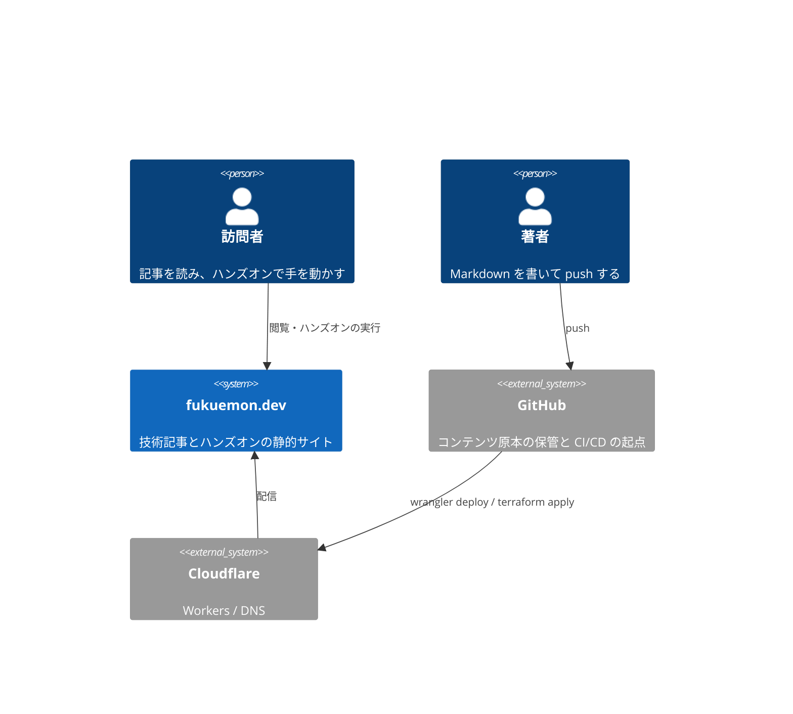
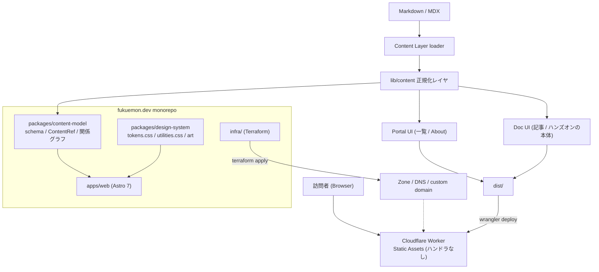
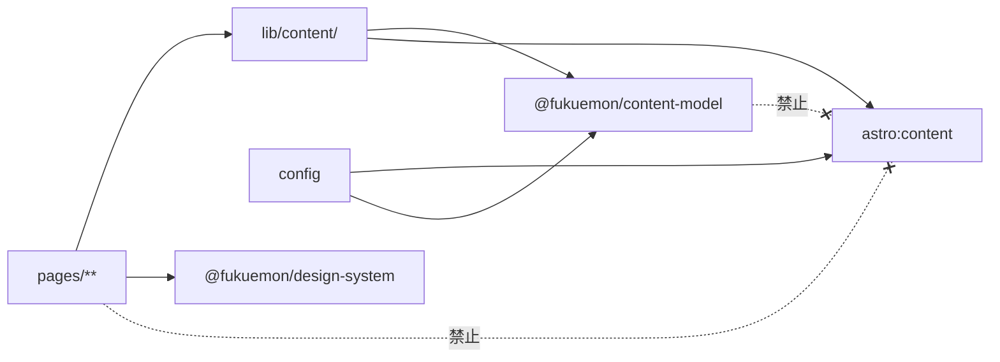

# fukuemon.dev Design Doc

**Document Status:** Draft
**Development Status:** TBD

本 Design Doc は fukuemon.dev の **全体像 (system landscape)** を扱う。
統合モードで作成しており、Why / What も本書が正本とする (`PRD.md` は作らない)。

**詳細は本書に重複させない。**
feature 単位の設計は [design/features/](features/)、技術規約は [context/](../context/)、判断とその代替案は [adr/](../adr/) を正本とする。

## 概要 (Summary)

fukuemon.dev は、**技術記事とハンズオンの 2 種類だけを公開する個人サイト**である。
ハンズオンは CLaaT 形式の Codelab、つまり手順に区切られ、進捗が残り、ブラウザのなかで実際にコードが動くものを指す。

中核価値は種別の多さではない。
**読んで分かった気になる段階と、動かして分かる段階のあいだを、同じサイトの中で埋めること**である。
記事とハンズオンは相互に参照し合い、片方から他方へ渡れる。

実装は pnpm workspace の monorepo とし、Astro 7 のアプリ 1 つと、Content Model / Design System の共有 package で構成する。
記事とハンズオンの描画も自前の Astro ページとして持つ。
配信は Cloudflare Workers Static Assets とし、基盤リソースを Terraform、deploy を Wrangler が管理する。

読者アカウントを持たず、サーバー側の永続状態も持たない。

---

## Why / What

### 背景・課題 (Why)

技術記事を読んで理解した気になっても、手を動かすところまでは繋がらない。
逆に、手を動かす教材は環境構築で止まる。

| 段階                 | 現状                                       | 問題                                             |
| -------------------- | ------------------------------------------ | ------------------------------------------------ |
| 読んで理解する       | 外部ブログサービス等に技術記事がある       | 読み終えた後に試す先がない                       |
| 手を動かして確かめる | 未作成                                     | 作る置き場がない                                 |
| その両方を行き来する | 存在しない                                 | 記事と教材が別々の場所にあり、相互に参照できない |

**分散していること自体が問題なのではない。**
同じ主題について「説明を読む」と「自分で壊してみる」が地続きになっていないことが問題である。

いま解決する理由は 2 つある。
ハンズオンをこれから作るため、置き場の設計を先に確定させる必要があること。
コンテンツが増えてから相互参照の仕組みを後付けすると、既存全件への metadata 付与が必要になり、着手コストが単調増加すること。

### 利用者

| 区分   | 対象          | 関心事                                                                 |
| ------ | ------------- | ---------------------------------------------------------------------- |
| 訪問者 | 技術者        | ある主題を読んで理解し、そのまま手を動かして確かめたい                 |
| 著者   | 運営者 (1 名) | Markdown を 1 枚足すだけで公開でき、体裁と索引の更新に手を取られたくない |

**読者アカウントを持つ学習者は利用者に含めない。**
理由は [ADR-0008](../adr/0008-no-reader-identity.md)。

### 提供価値 / 成功条件 (What)

| #   | 成功条件                                                       | 測定方法                                                                                                             |
| --- | -------------------------------------------------------------- | -------------------------------------------------------------------------------------------------------------------- |
| S1  | 記事とハンズオンを、種別で絞り込んだ一覧から辿れる             | `/blog`、`/blog/articles`、`/blog/labs` の 3 URL が静的に書き出され、それぞれ該当種別のみを列挙する。JavaScript を無効にしても機能する |
| S2  | コンテンツ間の関連が、片方向の記述だけで双方向に表示される     | 記事に `related: [<handsOnId>]` を書くと、ハンズオン側にも当該記事が表示される                                       |
| S3  | コンテンツの追加が Markdown ファイル 1 枚の作成で完結する      | 新規追加時に変更が必要なファイルが当該 Markdown のみ。索引ページの手動更新が発生しない                               |
| S4  | ハンズオンがブラウザだけで完結する                             | 手順中のコードをページ上で実行でき、実行環境のインストールを一切要求しない。進捗が再訪時に復元される                 |
| S5  | 初回表示が実用速度に収まる                                     | Lighthouse Performance 90 以上、LCP 2.5 秒以内 (Moto G Power / Slow 4G 相当)                                         |
| S6  | 公開に関わる Cloudflare 設定が Dashboard 上の属人設定として残らない | `infra/` の Terraform が Zone / DNS / custom domain を管理し、`terraform plan` に差分が出ない                    |

### スコープ

#### やること

- 技術記事 (Articles)
- ハンズオン (Hands-on) — CLaaT 形式の Codelab。
  手順の分割、進捗の保存、本文中でのコード実行
- 記事とハンズオンの相互参照
- 表紙 (`/`) と、種別で絞り込む一覧 (`/blog`、`/blog/articles`、`/blog/labs`)
- `/playground` — 手順に縛られず実行環境を触れる場所

- 自前 Content Model と、描画レイヤから独立した正規化レイヤ
- Design System (Design Tokens / Typography / 版面 / 動き)
- Cloudflare 基盤の Terraform 管理と Wrangler による deploy

#### やらないこと (Non-Goals)

**「まだ作らない」ではなく「作らない」ものである。**

| 項目                                                         | 理由                                                                                             |
| ------------------------------------------------------------ | ------------------------------------------------------------------------------------------------ |
| 登壇資料 (Slides) / 登壇実績 (Talks) の管理                  | 種別を 2 つに絞る。外部ホストの資料は About ページからリンクするに留める                         |
| 制作物 (Projects) の一覧                                     | 同上。ポートフォリオを目的としない                                                               |
| Topic 交差ページ                                             | 種別が 2 つでは交差が成立しない。相互参照 (`related`) で足りる                                   |
| Coverage View (分類 × 種別の網羅マトリクス)                  | 実質的に分類の索引であり、設計不変量 8 と衝突する。一覧の表が分類の列を持つため情報も重複する    |
| 分類 (tag) ごとの索引ページ                                  | 分類は組み合わせで数が爆発する。絞り込みは URL パラメータで行う (設計不変量 8)                  |
| 読者アカウント / 認証                                        | 個人サイトが読者の identity を獲得する動機がない ([ADR-0008](../adr/0008-no-reader-identity.md)) |
| Bookmark                                                     | ブラウザのブックマークと重複し、しかも劣る                                                       |
| Highlight / Annotation                                       | identity とテキストアンカーが要る。実装が重い割に利用者がいない                                  |
| サーバー側の永続状態                                         | 上記を作らないため要求元がない                                                                   |
| サイト全体の SPA 化                                          | React は Astro Islands として局所適用に限る                                                     |
| 汎用 UI コンポーネントライブラリの自作                       | 共通化は Design Tokens と版面のユーティリティまで                                                |
| 多言語対応                                                   | 日本語単一とする                                                                                 |
| 直接的な和風意匠 (桜 / 鳥居 / 筆文字 / 和柄 / 庭園写真)      | 版画的な自然の図版と縦組みで表現する。意匠の直輸入はしない ([design-system](features/design-system/DesignDoc_design-system.md)) |

---

## Goal

本 Design Doc は次を提供する。

- Why / What と成功条件
- C4 L1 / L2 の全体像とモジュール責務
- **設計不変量** — 将来のために今決める唯一のもの
- **条件つきバックログ** — 何が実在したら何を作るか
- 詳細文書への委譲先

## Non Goals

- feature 単位の画面仕様 → [design/features/](features/)
- 実装レベルの技術規約 → [context/](../context/)
- 判断の根拠と却下した代替案 → [adr/](../adr/)

---

## 設計上の前提

### バージョン制約

**Astro 7 を採る。** Node.js 22.12 以上を要求する。

意匠の土台は Tailwind CSS v4 ([ADR-0010](../adr/0010-tailwind-as-styling-base.md))。
preflight は読まず、トークンは `@theme static` に置く。

コードブロックは `astro-expressive-code`、図は `rehype-mermaid`、全文検索の索引は `pagefind` を使う ([ADR-0001](../adr/0001-starlight-as-docs-renderer.md))。

版の一覧は [context/toolchain.md](../context/toolchain.md) を正本とする。

### Astro 6 以降の識別子制約

Astro 6 で legacy content collections が撤去され、識別子は `id` に一本化された。
**content schema に `slug` を定義するとビルドが `ContentSchemaContainsSlugError` で失敗する。**
`id` は Astro がファイルパスから導出して占有する。
安定識別子は `contentId` という別名で持つ ([content-model](features/content-model/DesignDoc_content-model.md))。

### 前提用語

| 用語        | 定義                                                                                   |
| ----------- | -------------------------------------------------------------------------------------- |
| 種別        | 記事 (`articles`) とハンズオン (`handsOn`) の 2 つ。URL の分岐単位であり、増やさない  |
| 分類 (tag)  | 主題を示す自由語 (`postgres` / `observability` など)。索引ページを持たず、絞り込みと表示にのみ使う |
| `contentId` | コンテンツの安定識別子。ファイルパス・URL・ストレージから独立する                      |
| ContentRef  | 種別の異なるコンテンツを一覧で一様に扱うための正規化済み表現                            |
| 手順 (step) | ハンズオンを区切る単位。見出しから導出し、進捗の保存単位になる                          |

### 制約

- 運用者は 1 名。
  **レビューによる職務分離が成立しない**ため、規約は自動検査可能な形にする
- サーバーサイドの永続状態を持たない。
  動的機能は静的生成で表現できる範囲に限る
- 日本語の技術文書を主とし、本文には Latin の技術用語が高頻度で混在する

### 判断優先度

`context/project.yml` の `decision_priority` に反映する。

1. 一貫性 (Portal UI と Docs UI で同じ規約が成り立つこと)
2. 保守性 (1 名で維持できること)
3. パフォーマンス
4. 開発体験
5. 将来拡張性

**将来拡張性を最下位に置く。**
将来を可能にしているのは下記の設計不変量であって、先行実装ではない。

---

## アーキテクチャ概観 (Overview)

### System Context (C4 L1)

**ハンズオンの実行環境は訪問者のブラウザ内で完結する。**
実行のための外部システムを持たない。

### Container (C4 L2)

**すべてビルド時に解決する。**
実行時のサーバーコンポーネントを持たない。
ハンズオンのコード実行だけがクライアント側の実行時処理であり、それも WebAssembly としてブラウザ内で閉じる。

---

## モジュール責務

| モジュール                       | 責務                                                                                 | 公開境界                                                              | 依存先                         |
| -------------------------------- | ------------------------------------------------------------------------------------ | ---------------------------------------------------------------------- | ------------------------------ |
| `@fukuemon/content-model`        | Content Model の schema、`ContentRef` 型、関係グラフの構築と検証                     | `portalBase` / `ContentRef` / `buildContentGraph()`                    | `zod` のみ                     |
| `@fukuemon/design-system`        | Design Tokens (素の CSS)、版面のユーティリティ、挿絵、コードの配色                  | CSS カスタムプロパティ名、`utilities.css` の class、`code-theme`       | なし                           |
| `@fukuemon/config`               | tsconfig の共有設定。oxlint と vitest はルートで 1 つ持つ                            | `tsconfig/base.json`                                                   | なし                           |
| `apps/web/src/content.config.ts` | 全 collection の loader と schema を結線する。**データソースを切り替える唯一の場所** | collection 名                                                          | `astro:content`, content-model |
| `apps/web/src/lib/content/`      | `astro:content` のエントリを `ContentRef` へ写し、graph を組み立てる                 | `listContent()` / `getContent()` / `getRelated()`                      | `astro:content`, content-model |
| `apps/web/src/pages/**`          | Portal UI (about / 一覧 / playground)                                                | URL                                                                    | `lib/content`, components      |
| `apps/web/src/data/`             | 書いている人の正本。名乗り・外部リンク・使っているもの・登壇と寄稿                  | `PROFILE` / `LINKS` / `STACK` / `OUTSIDE`                              | なし                           |
| `apps/web/src/content/**`        | 記事とハンズオンの本体 (Markdown / MDX)                                              | —                                                                      | —                              |
| `apps/web/src/layouts/**`        | ページの外枠。`SiteLayout` を土台に `Posts` / `Article` / `Lab` と本文の `DocShell`  | —                                                                      | components                     |
| `apps/web/src/components/**`     | 部品。`.astro` と `.tsx` を同居させる。**`.tsx` は Astro を import しない**          | props                                                                  | `lib/content`                  |
| `infra/`                         | Zone / DNS / Workers custom domain                                                   | Terraform state                                                        | Cloudflare provider            |

依存規約の本文と検査手段は [context/architecture.md](../context/architecture.md) を正本とする。

---

## 設計不変量

**将来を可能にしているのはこの 8 点であり、将来構想の記述ではない。**
変えるときは ADR を書く。

| #   | 不変量                                                                      | 何を可能にするか                                                                  | 正本                                                               |
| --- | --------------------------------------------------------------------------- | --------------------------------------------------------------------------------- | ------------------------------------------------------------------ |
| 1   | `contentId` は発行後に変更しない                                            | URL 改名で関係が壊れない。将来の主キーになる                                      | [ADR-0002](../adr/0002-content-model-independence.md)              |
| 2   | 関係は `contentId` から `contentId` への片方向の辺とし、逆方向は導出する    | 書き忘れによる不整合が起きない。関係テーブルへそのまま写せる                      | [ADR-0002](../adr/0002-content-model-independence.md)              |
| 3   | `pages/**` と `components/**` は `astro:content` を直接参照しない           | ページ実装がデータソースに依存しない                                              | [ADR-0002](../adr/0002-content-model-independence.md)              |
| 4   | `@fukuemon/content-model` は Astro に依存しない                             | Astro なしで単体テストできる。別の消費者から再利用できる                          | [ADR-0002](../adr/0002-content-model-independence.md)              |
| 5   | `tokens.css` は素の CSS で書き、ユーティリティは `@layer` に閉じる           | レイヤ外の宣言はあらゆるレイヤ内の宣言に優先する。第三者の CSS と競合しない | [design-system](features/design-system/DesignDoc_design-system.md) |
| 6   | 1 つの Cloudflare リソースを Terraform と Wrangler の両方から管理しない     | 二重管理による差分の消し合いが起きない                                            | [ADR-0005](../adr/0005-workers-terraform-wrangler-boundary.md)     |
| 7   | cross-origin isolation をサイト全体に掛けない。必要な経路にのみ掛ける       | 全体に掛けると外部埋め込みが一律で壊れる。影響範囲を局所に閉じる                  | [ADR-0006](../adr/0006-interactive-content-levels.md)              |
| 8   | 種別は URL を持つページとして分け、分類 (tag) は URL パラメータで絞り込む   | 種別は 2 つで固定なので静的に書き出せる。分類は組み合わせで数が爆発する           | 本書 (下記)                                                        |

**この 8 点以外に、将来のための先行投資をしない。**

### URL 構成

サイトは about / blog / playground の 3 面である ([ADR-0009](../adr/0009-site-sections-and-playground-collection.md))。

| URL                | 中身                                                       |
| ------------------ | ---------------------------------------------------------- |
| `/`                | 表紙。about が兼ねる。最近の更新、各面への入口、登壇と寄稿 |
| `/blog`            | すべての一覧 (表)                                          |
| `/blog/articles`   | 記事だけの一覧                                             |
| `/blog/labs`       | ハンズオンだけの一覧                                       |
| `/articles/<path>` | 記事の本体                                                 |
| `/labs/<path>`     | ハンズオンの本体                                           |
| `/playground`      | 遊び場の一覧                                               |
| `/playground/<id>` | 1 つの遊び場。cross-origin isolation を予約している (未適用) |
| `/rss.xml`         | RSS                                                        |

**表紙と一覧を分ける。**
表紙は伝える場所、一覧は探す場所であり、要求が異なる。

**about に独立したページを与えない。** 分量が増えないものに 1 ページを割かない。
表紙を about が兼ねる。伝える場所に置くものが 2 つあると、どちらの印象も薄くなる。

一覧のタブと本文の検索は `/blog` 以下の 3 ページにだけ出る。
**検索を全ページの上端に置かない。** 探す気がある人は一覧まで来る。

`/articles/<path>` は本体の URL であり、`/blog/articles` は一覧である。
**描画の実装詳細を URL に露出しない** ([ADR-0001](../adr/0001-starlight-as-docs-renderer.md))。

### 不変量 8 の補足 — 種別と分類の切り分け

一覧の切り替えは、見た目はタブだが**実体はページ遷移**である。
ARIA の `tablist` は使わない。

| 軸                                | 実現方法                              | 理由                                                                 |
| --------------------------------- | ------------------------------------- | -------------------------------------------------------------------- |
| 種別 (すべて / 記事 / ハンズオン) | `/blog`、`/blog/articles`、`/blog/labs` の 3 ページ | 3 つで固定。URL が付き、共有と戻るボタンが効く。JavaScript が要らない |
| 分類 (`postgres` など)            | URL パラメータ + クライアント側の絞り込み | 種別 3 × 分類 n の組み合わせをページとして書き出せない               |

同一ページでの切り替えでも `history.pushState` で URL は付けられる。
ただしそれは、3 枚の静的ページで済むことを JavaScript で再実装している状態になる。

---

## いま作るもの

| 領域       | 内容                                                                                             |
| ---------- | ------------------------------------------------------------------------------------------------ |
| コンテンツ | About、Articles、Hands-on                                                                        |
| 中核       | 種別で絞り込む一覧、記事とハンズオンの相互参照、ハンズオンの手順分割と進捗保存、本文中でのコード実行 |
| 基盤       | monorepo の骨格、Content Model と関係グラフ、Design Tokens とフォントの self-host、Cloudflare の Terraform 管理と deploy |
| 品質       | 依存規約 2 本の機械検査、`content-model` の分岐カバレッジ 100%、一覧と相互参照の E2E             |

**完了の判定**: 成功条件 S1〜S6 が測定可能な形で満たされていること。

### 既存アウトプットの移行は先送りする

**土台を新規コンテンツ前提で作る。**
既存の記事の一括登録は行わない。

理由は 2 つある。
棚卸しは着手を止めるだけで、土台の設計を 1 つも確定させないこと。
**分類の粒度は既存の棚卸しより、実際に書いた数件のコンテンツから決めたほうが正確になる**こと (棚卸しは過去の分類であり、これから書くものの分類ではない)。

代わりに **seed コンテンツ**を新規に作り、機構が動くことを証明する。

| 種別       | seed の点数 | 目的                                                                     |
| ---------- | ----------- | ------------------------------------------------------------------------ |
| `articles` | 2           | 本文の描画と `portalBase` の結線。一覧に 2 件以上並ぶ状態を作る          |
| `handsOn`  | 1           | 手順の導出、進捗の保存、コードの実行                                    |

**seed は捨てないコンテンツにする。**
ダミーテキストではなく、実際に公開する内容を書く。
ダミーだと Design System の検証にならず (日本語の分量と技術用語の混在が本物と違う)、後で消す作業も発生する。

`related` は記事とハンズオンのあいだに 1 本以上張り、成功条件 S2 (逆参照の導出) を測定できる状態にする。

**分類は暫定でよい。**
増減する前提で始め、コンテンツが 10 件を超えた時点で見直す。
`contentId` と違い分類は改名できる (関係の主キーではないため)。

### 実装中に検証すること

**下記はいずれも未検証の前提である。**
満たさない場合の代替を併記する。

| #   | 内容                                                                             | 満たさない場合                                                                   |
| --- | -------------------------------------------------------------------------------- | -------------------------------------------------------------------------------- |
| 5   | `vp run --cache` が `astro build` の入力を正しく推論すること (3 項目)            | キャッシュ無効化、または Turborepo へ切り替え                                    |
| 6   | `cloudflare_workers_custom_domain` が Wrangler deploy 済みの Worker へ紐付くこと | provider の issue を再確認し、`cloudflare_workers_route` + DNS record へ切り替え |
| 7   | R2 backend の `skip_s3_checksum` で state 書き込みが通ること                     | state backend をローカル + 手動バックアップへ落とす                              |

検証を終えた前提は次のとおり。

| 内容                                                                     | 結果                                                          |
| ------------------------------------------------------------------------ | ------------------------------------------------------------- |
| `astro-expressive-code` で画面案のコード意匠を出せること                 | 満たす。意匠は `styleOverrides` から指定する                  |
| 実行パネルを Expressive Code の枠外に置いて意匠が揃うこと                | 満たす。枠の中へ差し込む必要は無かった                        |
| `pagefind` が自前ページを索引すること                                    | 満たす。`data-pagefind-body` は本文の要素にだけ付ける         |
| config の rehype plugin が Expressive Code より先に走ること              | 満たす。素の `<pre><code>` のまま拾えるので `rehype-mermaid` が効く |

---

## 条件つきバックログ

**時期では判断しない。
左の条件が実在したときに作る。**

| 条件                                                 | 作るもの                                                              | 設計                                                               |
| ---------------------------------------------------- | ---------------------------------------------------------------------- | ------------------------------------------------------------------ |
| 分類での絞り込みが要ると判断したとき                 | URL パラメータによる絞り込み (React Island)。**ページは増やさない**    | 設計不変量 8                                                       |
| 分類が 12 を超えたとき                               | 分類ごとの絞り込み (URL パラメータ)。**索引ページは作らない**           | 設計不変量 8                                                       |
| 見せるためのコンポーネント集を作りたくなったとき     | `packages/<name>/` と、実物を並べる demo ページ。**別 repo も検討する** | [context/architecture.md](../context/architecture.md) の package を増やす条件 |
| コンテンツが増えて一覧から辿れなくなったとき         | Command Palette (React Island + shadcn/ui)                             | —                                                                  |
| 本文中で PGlite 以外の実行環境が要るハンズオンが実在したとき | 該当ランタイムの Island。**ヘッダを変えずに載る場合に限る**            | [interactive](features/interactive/DesignDoc_interactive.md)       |
| SharedArrayBuffer が要るハンズオンが実在したとき     | isolated な別ドキュメント (`/playground/<id>`)                         | [interactive](features/interactive/DesignDoc_interactive.md)       |
| コメントが欲しくなったとき                           | giscus (GitHub Discussions)。**バックエンド不要**                      | [ADR-0008](../adr/0008-no-reader-identity.md)                      |
| Contact form の送信受け口が要るとき                  | 同一 Worker の `/api/contact` に POST 1 本                             | [context/infrastructure.md](../context/infrastructure.md)          |
| ビルド時に解決できない検索が要ると判明したとき       | まず静的 embedding 索引 + クライアント検索を試す                       | [ADR-0008](../adr/0008-no-reader-identity.md)                      |

**バックログに無いものは作らない。**
読者 identity を前提とする機能と、Non-Goals に挙げた種別の追加は、バックログにも載せない。

---

## 詳細の所在 (委譲先)

### Feature 設計

| Feature                    | 文書                                                                         | 状態   |
| -------------------------- | ---------------------------------------------------------------------------- | ------ |
| Content Model              | [features/content-model/](features/content-model/DesignDoc_content-model.md) | 未着手 |
| Design System              | [features/design-system/](features/design-system/DesignDoc_design-system.md) | 未着手 |
| ハンズオンと Interactive   | [features/interactive/](features/interactive/DesignDoc_interactive.md)       | 未着手 |

### Engineering Context

プロジェクト固有値は [context/project.yml](../context/project.yml) を正本とする。
**本 Design Doc 承認後、`context-bootstrap` skill で初期化する。**
現時点の `project.yml` はプレースホルダである。

| トピック                                                    | 文書                                                      |
| ----------------------------------------------------------- | --------------------------------------------------------- |
| package 境界 / 依存規約 / ディレクトリ / URL 規約           | [context/architecture.md](../context/architecture.md)     |
| ツール構成 / Vite+ の適用範囲 / 品質ゲートの採否            | [context/toolchain.md](../context/toolchain.md)           |
| 共有設定 / root task / quality gate / コメント規約          | [context/engineering.md](../context/engineering.md)       |
| テスト責務 / 書き方 / カバレッジ要求                        | [context/testing.md](../context/testing.md)               |
| Terraform / Wrangler 管轄 / bootstrap / credential / ヘッダ | [context/infrastructure.md](../context/infrastructure.md) |

### Related ADRs

| ADR                                                        | 決定                                                                                         |
| ---------------------------------------------------------- | -------------------------------------------------------------------------------------------- |
| [0001](../adr/0001-starlight-as-docs-renderer.md)          | Starlight を採らず、Astro 単体 + Expressive Code + Pagefind で組む                           |
| [0002](../adr/0002-content-model-independence.md)          | 関係を `contentId` の辺として持ち、Content Model を Astro 非依存に保つ                       |
| [0003](../adr/0003-monorepo-and-vite-plus.md)              | pnpm workspace の monorepo とし、Vite+ を `vp run` / `vp env` / 同梱ツールに限定して採用する |
| [0004](../adr/0004-typography-static-weights.md)           | 和文に静的 2 ウェイトの Zen Old Mincho を採り、可変フォントを使わず self-host する           |
| [0005](../adr/0005-workers-terraform-wrangler-boundary.md) | Cloudflare Workers Static Assets を採用し、基盤を Terraform、deploy を Wrangler が管理する   |
| [0006](../adr/0006-interactive-content-levels.md)          | 手を動かす場所を 4 つに分け、cross-origin isolation を局所に限定する                          |
| [0007](../adr/0007-quality-gates.md)                       | 品質ゲートに react-doctor / knip / similarity-ts を採り、mise / Bun / Biome を採らない       |
| [0008](../adr/0008-no-reader-identity.md)                  | 読者の identity を前提とする機能を作らない。バックエンドを持たない                           |
| [0010](../adr/0010-tailwind-as-styling-base.md)             | Tailwind CSS v4 を意匠の土台にし、部品の CSS を utility へ移す                              |
| [0009](../adr/0009-site-sections-and-playground-collection.md) | サイトを about / blog / playground の 3 面に分け、playground を collection にする         |

---

## Open Questions

**未決事項は各 feature doc / context に置く。**
ここには、複数文書にまたがるものだけを残す。

| #   | 論点                                                   | 期限                 | 状態                                                           | 影響先                         |
| --- | ------------------------------------------------------ | -------------------- | -------------------------------------------------------------- | ------------------------------ |
| Q1  | 既存記事の移行 (過去の記事の一括登録)                  | 土台の完成後         | **先送り。着手のブロッカーではない**。seed コンテンツで代替する | content-model                  |
| Q2  | `status: draft` のコンテンツをビルドに含めるか         | 実装着手前           | 未決                                                           | content-model / infrastructure |
| Q3  | About ページの構成 (見開き形式を採るか)                | Design System 実装時 | 未決。画面案では別案 甲 (見開き) を候補としている              | design-system                  |

---

## 関連ドキュメント

- [context/project.yml](../context/project.yml): プロジェクト固有値の唯一の正本 (未初期化)
- [context/architecture.md](../context/architecture.md): package 境界 / 依存規約 / URL 規約
- [context/toolchain.md](../context/toolchain.md): ツール構成
- [context/engineering.md](../context/engineering.md): 共有設定 / root task / quality gate
- [context/testing.md](../context/testing.md): テスト方針
- [context/infrastructure.md](../context/infrastructure.md): Cloudflare の管轄と運用
- [adr/](../adr/): 確定した技術判断と却下した代替案
- [design/features/](features/): feature 単位の設計
