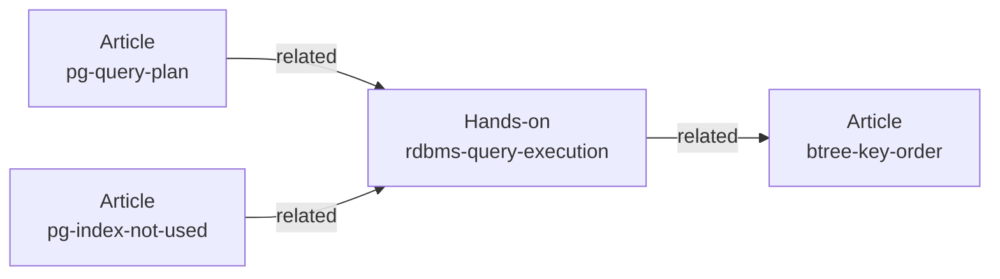

# Feature 設計: Content Model

全体像は [design/DesignDoc.md](../../DesignDoc.md)、横断規約は [context/](../../../context/) を参照する。
判断の理由は [ADR-0002](../../../adr/0002-content-model-independence.md)。

## 背景・要件解釈

サイトの中核価値は、読んで理解する段階と手を動かして確かめる段階が地続きになることである。
これを成立させるには、記事とハンズオンが**同一の一覧に載り、互いを参照できる**必要がある。

本 feature が満たす成功条件は次の 3 つである。

| #   | 成功条件                                                   |
| --- | ---------------------------------------------------------- |
| S1  | 記事とハンズオンを、種別で絞り込んだ一覧から辿れる         |
| S2  | コンテンツ間の関連が、片方向の記述だけで双方向に表示される |
| S3  | コンテンツの追加が Markdown ファイル 1 枚の作成で完結する  |

## スコープ

### やること

- 記事とハンズオンに共通する schema (`portalBase`) と種別ごとの拡張
- 安定識別子 `contentId` の定義と一意性検査
- 相互参照グラフの構築、dangling 参照の検出、逆参照の導出
- `ContentRef` への正規化
- Astro Content Layer の loader との結線

### やらないこと

- 一覧ページと詳細ページの表示仕様 → [design-system](../design-system/DesignDoc_design-system.md)
- ハンズオンの実行方法と進捗の保存 → [interactive](../interactive/DesignDoc_interactive.md)
- 分類 (tag) ごとの索引ページ。
  **分類は URL パラメータでの絞り込みにのみ使う** (設計不変量 8)
- CMS / 別データソースの実装。
  **loader を差し替え点に 1 本化する**ところまでを本 feature の範囲とする

## 設計

### 安定識別子

Astro は `id` をファイルパスから導出して占有する。
**`slug` を schema に定義するとビルドが `ContentSchemaContainsSlugError` で失敗する。**
自前の安定識別子は `contentId` として持つ。

```yaml
contentId: rdbms-query-execution # 発行後は変更しない。全 collection をまたいで一意
path: labs/rdbms-query-execution # URL パス。改名可能
```

**発行規則**: `^[a-z0-9][a-z0-9-]*$`。
内容を表す語をハイフンでつなぐ。
日付や連番を含めない (改名の動機になるため)。

### 共通 schema

```ts
// packages/content-model/schema.ts
export const portalBase = z.object({
  contentId: z.string().regex(/^[a-z0-9][a-z0-9-]*$/),
  title: z.string(),
  description: z.string(),
  tags: z.array(z.string()).min(1), // 表示と絞り込みに使う自由語
  status: z.enum(["draft", "published", "archived"]).default("draft"),
  publishedAt: z.coerce.date(),
  updatedAt: z.coerce.date().optional(),
  related: z.array(z.string()).default([]), // 他コンテンツの contentId
  repository: z.object({ url: z.string().url(), path: z.string().optional() }).optional(),
});
```

**`tags` を 1 つ以上必須にする。**
一覧の分類列に必ず値が入る状態を保つためである。
索引ページを持たないので、値の集合を事前に定義しない。

### 種別ごとの拡張

**読み物の種別は 2 つだけであり、増やさない** (設計不変量 8)。

| collection    | 追加属性                                                                            | 描画                   |
| ------------- | ----------------------------------------------------------------------------------- | ---------------------- |
| `articles`    | 持たない                                                                            | `ArticleLayout`        |
| `labs`        | `difficulty`, `duration: number`, `setup?: string`, `interactive?: InteractiveSpec` | `LabLayout` + 手順一覧 |
| `playgrounds` | `runtime`, `setup?`, `presets`, `order`                                             | playground 専用ページ  |

**`playgrounds` は種別ではない。**
一覧のタブにも RSS にも出ず、`ContentRef` にも写さない ([ADR-0009](../../../adr/0009-site-sections-and-playground-collection.md))。
collection にするのは、遊び場を足す手順を記事と同じ「Markdown 1 枚」に保つためである。

**記事は固有の属性を持たない。** 読了時間を出さない。
手で書くと本文の分量とずれ、ずれた数字は同じ行にある実測値まで疑われる。

`difficulty` は `'beginner' | 'intermediate' | 'advanced'`。
`interactive` の型は [interactive](../interactive/DesignDoc_interactive.md) が定める。

**ハンズオンは手順数を frontmatter に持たない。**
本文の `h2` から導出する。
frontmatter に書くと本文と二重管理になり、手順を足したときに片方だけ古くなる。

### 分類 (tag) の扱い

| 軸                                | 実現方法                                            | 索引ページ |
| --------------------------------- | --------------------------------------------------- | ---------- |
| 種別 (すべて / 記事 / ハンズオン) | `/blog`、`/blog/articles`、`/blog/labs` の 3 ページ | 持つ       |
| 分類 (`postgres` など)            | URL パラメータ + クライアント側の絞り込み           | 持たない   |

**分類を束ねる上位の分類軸を持たない。**
種別が 2 つなので、分類ごとの交差ページを作っても相互参照 (`related`) 以上のものが得られない。
判断の全文は [design/DesignDoc.md](../../DesignDoc.md) の Non-Goals にある。

### 相互参照グラフ

`related` は他コンテンツの `contentId` の配列とする。
**Astro の `reference()` を使わない。**



`related` は**著者が明示した筋**である。
分類が同じであることとは別軸であり、分類から自動生成しない。

`buildContentGraph()` が次を行う。

| 処理                   | 失敗時の挙動                               |
| ---------------------- | ------------------------------------------ |
| `contentId` 索引の構築 | 重複があればビルドを失敗させる             |
| `related` の解決       | 解決できない参照があればビルドを失敗させる |
| 逆参照の導出           | —                                          |

**著者は関係を片方向だけ記述し、逆方向は導出する。**
双方向の手動記述は片側の書き忘れで不整合を生むため許さない。

### ContentRef

一覧ページが collection ごとの分岐を持たないための正規化表現である。

```ts
// packages/content-model/types.ts
export type ContentRef = {
  contentId: string;
  type: "article" | "hands-on";
  title: string;
  description: string;
  href: string; // 種別ごとの URL 規則を吸収した最終 URL
  tags: string[];
  date: Date;
  meta: { label: string; value: string }[]; // 種別固有の表示用 metadata
};
```

**種別が 2 つに減っても `ContentRef` は残す。**
理由は種別の多さではなく、設計不変量 3 (`pages/**` は `astro:content` を直接参照しない) を成立させることにある。
`href` / `meta` が吸収層であり、**URL 規則や描画レイヤを変えるとき、変わるのは `href` の算出規則だけである。**

`meta` の中身は一覧の「種類」列に出る文字列に対応する。

| 種別       | `meta` の例                                                               |
| ---------- | ------------------------------------------------------------------------- |
| `article`  | `[{ label: "所要", value: "12分" }]`                                      |
| `hands-on` | `[{ label: "所要", value: "60分" }, { label: "手順", value: "全 9 歩" }]` |

### コンポーネント構成 (C4 L3)

```mermaid
flowchart TD
    subgraph cm ["@fukuemon/content-model (Astro 非依存)"]
        schema["schema.ts<br/>portalBase / 種別拡張"]
        types["types.ts<br/>ContentRef"]
        graph["graph.ts<br/>buildContentGraph()"]
    end
    subgraph web ["apps/web"]
        config["content.config.ts<br/>loader と schema の結線"]
        adapter["lib/content/<br/>listContent / getContent / getRelated"]
        pages["pages/**"]
    end
    ac["astro:content"]
    config --> ac
    config --> schema
    adapter --> ac
    adapter --> graph
    adapter --> types
    pages --> adapter
    graph --> types
```

`listContent()` は種別での絞り込みを引数で受ける。
**一覧の 3 ページは、同じ関数を異なる引数で呼ぶだけで作る。**

```ts
listContent(); // すべて → /blog
listContent({ type: "article" }); // 記事 → /blog/articles
listContent({ type: "hands-on" }); // ハンズオン → /blog/labs
```

### loader との結線

```ts
// apps/web/src/content.config.ts
const loader = (dir: string) => glob({ base: `./src/content/${dir}`, pattern: "**/*.{md,mdx}" });

// データソースを差し替える点。schema は種別ごとに持つ
export const collections = {
  articles: defineCollection({ loader: loader("articles"), schema: articleSchema }),
  labs: defineCollection({ loader: loader("labs"), schema: handsOnSchema }),
  playgrounds: defineCollection({ loader: loader("playgrounds"), schema: playgroundSchema }),
};
```

**collection を種別ごとに分ける。**
種別は collection 名そのものであり、frontmatter にもディレクトリ判定にも依存しない。

**種別ごとに schema が違う。**
`articles` は `difficulty` や `duration` を持たない。
1 つの collection にまとめると、片方だけが持つ属性をすべて optional にすることになり、schema が種別の違いを表現できなくなる。

## 主要シナリオ / フロー

### コンテンツを 1 件追加する

1. 著者が `apps/web/src/content/labs/<name>.md` を作り、frontmatter に `contentId` / `title` / `description` / `tags` / `publishedAt` を書く
2. 関連があれば `related` に相手の `contentId` を書く (片方向のみ)
3. ビルドが `contentId` の一意性と `related` の解決を検査する
4. 該当する一覧 (ハンズオンなら `/blog` と `/blog/labs`) と、相手側の「関連コンテンツ」に自動で現れる

**索引ページを手で更新する作業が発生しない** (成功条件 S3)。

### 参照が壊れたとき

`related` に存在しない `contentId` を書くと**ビルドが失敗する。**
警告ではなく失敗にするのは、静的サイトでは「関連が表示されない」形で静かに壊れ、目視で気づけないためである。

## テスト観点

横断規約は [context/testing.md](../../../context/testing.md)。
本 feature 固有の観点は次である。

- `packages/content-model` は**分岐カバレッジ 100%** を要求する
- dangling 参照の検出、逆参照の導出、`contentId` 重複の検出は分岐を全部踏む
- 逆参照は「A → B を書いたとき B の関連に A が出る」を 1 テスト 1 `expect` で確認する
- `ContentRef` の生成は `toStrictEqual` で全体比較する。
  フィールドごとの検査にしない
- `listContent({ type })` は、種別ごとの件数と並び順 (新しい順) を確認する

## 未決事項

| #   | 論点                                                                                                 | 期限                      | 状態                                                                                                                      |
| --- | ---------------------------------------------------------------------------------------------------- | ------------------------- | ------------------------------------------------------------------------------------------------------------------------- |
| 1   | 分類 (tag) の粒度と初期セット                                                                        | seed コンテンツを書いた後 | **暫定で始める。** 索引ページを持たないので、値の集合を事前に確定させる必要がない。コンテンツが 10 件を超えた時点で見直す |
| 2   | `repository` の表示位置 (ハンズオン本文に出すか、詳細の末尾に留めるか)                               | 実装着手前                | 未決                                                                                                                      |
| 3   | `status: draft` のコンテンツをビルドに含めるか (プレビュー用に含めて `noindex` にするか、除外するか) | 実装着手前                | 未決                                                                                                                      |

## 関連ドキュメント

- [design/DesignDoc.md](../../DesignDoc.md): 全体像
- [ADR-0002](../../../adr/0002-content-model-independence.md): 本 feature の判断の正本
- [ADR-0001](../../../adr/0001-starlight-as-docs-renderer.md): 描画レイヤを自前で持つ決定
- [design-system](../design-system/DesignDoc_design-system.md): `ContentRef` の消費側 (一覧の表示仕様)
- [interactive](../interactive/DesignDoc_interactive.md): `interactive` の型
- [context/architecture.md](../../../context/architecture.md): 依存規約
- [context/testing.md](../../../context/testing.md): カバレッジ要求
