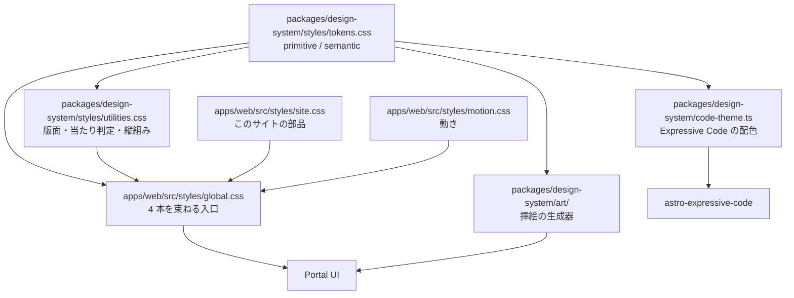

# Feature 設計: Design System

全体像は [design/DesignDoc.md](../../DesignDoc.md)、横断規約は [context/](../../../context/) を参照する。
Typography の判断理由は [ADR-0004](../../../adr/0004-typography-static-weights.md)。

## 背景・要件解釈

技術資料としての硬質さを土台にし、そこへ**版画的な自然の図版と縦組みの見出し**を足す。
装飾は挿絵と差し色だけが担い、情報を運ぶ要素は罫線と余白で組む。

参考サイト (torus-engineering) の `styles.css` を 2026-08-25 に実測した。

| 観測項目                            | 実測値                                               | 採否                                       |
| ----------------------------------- | ---------------------------------------------------- | ------------------------------------------ |
| 本文・見出し・UI の書体             | すべて Serif。Sans は 0 件                           | **採る**                                   |
| `border-radius`                     | 0 件                                                 | **採る**                                   |
| `box-shadow`                        | 0 件                                                 | **採る**                                   |
| 色数                                | 6 値。アクセントカラーなし                           | 一部採る (差し色を 3 色足す)               |
| 見出しスケール                      | h2 = 1.25rem、h3 = 1.05rem (本文 1.05rem とほぼ同寸) | **採る**                                   |
| 階層の作り方                        | サイズ差ではなく small-caps + letter-spacing + 罫線  | **採る**                                   |
| 本文カラム幅                        | 44rem / 36rem / 32rem                                | 本文には採る。一覧には採らない             |
| `:lang(ja) { text-align: justify }` | 有                                                   | **採らない**。字間 `.05em` と `overflow-wrap: anywhere` で組む |
| Mono                                | Courier New のみ、metadata には未使用                | **採らない**。metadata に Mono を使う      |

**採らない理由**: 参考サイトは 44rem 単一カラムの論文であり、一覧ページの語彙を持たない。
一覧レイアウトには参照元が存在しないため独自に定義する。

## スコープ

### やること

- Design Tokens (primitive / semantic) を素の CSS カスタムプロパティで定義する
- Typography / 縦組み / Color / Spacing / Grid の確定値
- 明るい配色と暗い配色の両方
- 挿絵の版の仕様と、図柄を足す手順
- 動きの規則と、退行したときの見え方
- 印 (icon) を使ってよい範囲
- 版面のユーティリティ (`.g-rail` / `.g-doc` / `.tate` / `.hit` / 罫の 3 段階)

### やらないこと

- 汎用 UI コンポーネントライブラリの自作。
  共通化はトークンと版面のユーティリティまでとする
- **Layout primitives の component 化。**
  `Stack` / `Frame` のような包む component を作らず、class で当てる。
  Astro と React が混在するので、component にすると同じものを 2 度書くことになる
- Portal components (`ContentRow` / `MetaLine` 等) の設計 → 各 feature doc
- 挿絵の描画コードそのもの。
  **本書は版の仕様を定め、実装は `packages/design-system/art/` に置く**

## 設計

### 意匠の方針

**情報を運ぶ要素は無彩色と罫線だけで組む。**
色を持つのは、挿絵・リンク・現在地マーカーの 3 つに限る。

| 規則                                     | 根拠                                                                       |
| ---------------------------------------- | -------------------------------------------------------------------------- |
| カードを使わない                         | 枠を足すと 1 件あたりの視覚的重量が増え、一覧の走査が遅くなる              |
| 区画は罫線と余白で作る                   | 背景色で区切ると、暗い配色で面どうしの明度差を 1.10 しか取れず区別が消える |
| 罫線は 2px / 1px / 薄い 1px の 3 段階のみ | 段階を増やすと、どれがセクション境界か行境界かを読み取れなくなる           |
| 角丸を使わず、影で奥行きを作らない       | 紙に刷った版面の見えを保つ。角丸と落ち影は画面上の物体を示唆する          |
| 見出しをほとんど大きくしない             | 階層は small-caps・letter-spacing・罫線で作る                              |
| 状態を色だけで運ばない                   | forced colors mode では色と `box-shadow` が失われる。罫か字形を必ず併せる  |

面を持ってよいのは次の 3 つに限る。
どれも輪郭に 1px 以上の罫を必須とする。
暗い配色では面どうしの明度差が 1.10 しか取れず、罫がないと境界が消える。

| 面                         | 用途                                     |
| -------------------------- | ---------------------------------------- |
| 反転帯 (`data-band`)       | 読みの区切りに置く強い休符               |
| コード面 (`--code-bg`)     | コードブロックとその chrome              |
| 注記 (`--tint-*`)          | 前提 / 補足 / 注意、コードの強調行       |

帯の中では変数を丸ごと差し替え、地のトークンを引けなくする。

### Typography

| 役割       | 書体                    | ウェイト         | 用途                                      |
| ---------- | ----------------------- | ---------------- | ----------------------------------------- |
| 和文 Serif | **Zen Old Mincho**      | 400 / 600 (静的) | 本文・見出し・UI のすべて                 |
| 欧文 Serif | **EB Garamond**         | 400 / 600 (可変) | 和文と同じ位置。Latin グリフを担当        |
| Mono       | **Geist Mono Variable** | 400 / 600        | 日付・種別・duration・`contentId`・コード |

```css
--font-serif: "EB Garamond", "Zen Old Mincho", "Yu Mincho", serif;
--font-mono: "Geist Mono Variable", ui-monospace, monospace;
/* 一覧の日付の桁を揃える */
.mono { font-variant-numeric: tabular-nums; }
```

EB Garamond を先に置く。
CSS は左から順にグリフを探すため、Latin は EB Garamond、和文は Zen Old Mincho が担当する。

**Fontsource で self-host する。
外部 CDN から読まない。**
使うウェイトを 400 / 600 に絞る。
理由は [ADR-0004](../../../adr/0004-typography-static-weights.md)。

#### 型スケール

| 要素            | size    | weight | line-height | 備考                              |
| --------------- | ------- | ------ | ----------- | --------------------------------- |
| Hero            | `clamp(1.75rem, 4.4vw, 2.75rem)` | 400 | 1.18 | サイト内で唯一大きい要素 |
| h2              | 1.25rem | 600    | 1.25        | —                                 |
| h3              | 1.05rem | 600    | 1.30        | 本文と同寸                        |
| body            | 1.05rem | 400    | 1.85        | 字間 `.05em`、`overflow-wrap: anywhere` |
| small / caption | 0.875rem | 400   | 1.4         | 手順名、ロゴ                      |
| metadata (Mono) | 0.8125rem | 400  | 1.0         | 字間は既定。必要な箇所へ個別に当てる |
| section label   | 0.85rem | 400    | 1.0         | small-caps、letter-spacing 0.12em |

見出しには `font-feature-settings: "palt" 1` と `line-break: strict` を掛ける。
和文の詰めを効かせ、禁則を厳格側にする。

### 縦組み

節見出しと記事ページの柱 (ページ端の走り見出し) を縦組みにする。

**縦組みへ入れてよいのは和文だけである。**

| 対象                       | 扱い                                        |
| -------------------------- | ------------------------------------------- |
| 和文                     | そのまま正立する (`text-orientation: mixed` の既定)      |
| 3 文字までの数字・略語   | `text-combine-upright: all` で 1 マスに畳んで正立させる   |
| 4 文字以上の欧文 (本文)  | 横倒しのまま残す。縦組みの通常の組み方である             |
| 4 文字以上の欧文 (見出し) | `text-orientation: upright` で 1 字ずつ正立させて積む    |
| ロゴなど正立必須の欧文   | **縦組みへ入れない。** 横組みのヘッダに置く              |

**本文では全部を正立させない。**
日本語組版処理の要件 (JLReq) では、縦組みの欧文は 90 度回転が原則である。
`text-orientation: upright` を掛けると `OpenTelemetry Collector` が縦に 21 文字積まれ、帯だけが伸びる。

畳む長さの上限を 3 文字にするのは、4 文字を超えると 1 マスに収めたとき字が潰れるためである。

**見出しだけを例外にする。**
`about` のような 4 文字以上の欧文の見出しは、原則どおり回転させると横倒しのまま残る。
見出しは読み手が節を探すときに最初に当たる語なので、寝かせない。
長さの上限が要らないのは、見出しが数語で終わるためである。

割り振りは `apps/web/src/lib/tate.ts` の `tcy()` が行う。
見出しの例外は `<Tate upright />` で明示する。
著者は本文を書くときに意識しない。

```css
.tate {
  writing-mode: vertical-rl;
  text-orientation: mixed;
  font-feature-settings: "vpal" 1, "vkrn" 1;
  line-break: strict;
}
.tcy { text-combine-upright: all; }
```

#### 実装上の制約

**縦組みでは block 軸と inline 軸が入れ替わる。**
`block-size` は「高さ」ではなく「幅」を意味し、`flex-direction: column` は横方向に並ぶ。

規則: **`.tate` は中の `span` にだけ掛け、親は横組みのまま置く。**

親に掛けると、位置と寸法の指定がすべて逆の意味になる。
`block-size: 520px` は高さではなく幅として解釈され、版面をその分だけ押し出す。

### Color

**値の正本は [packages/design-system/styles/tokens.css](../../../packages/design-system/styles/tokens.css) である。**
本書は値を複写しない。
複写すると実装と二重管理になり、片方が古くなったことに気づけない。

本書が定めるのは、トークンの**層**と**使用制約**である。

| 層        | 例                                              | 規則                                                       |
| --------- | ----------------------------------------------- | ---------------------------------------------------------- |
| primitive | `--ink` / `--green` / `--rule-strong`           | 色そのもの。画面から直接参照しない                         |
| semantic  | `--fg` / `--link` / `--now` / `--rule`          | 画面はここだけを参照する                                    |
| 面        | `--paper` / `--panel` / `--code-bg` / `--tint-*` | 輪郭に 1px 以上の罫を必須とする                            |
| 帯        | `[data-band]` が差し替える 7 変数               | 帯専用の値。primitive のどれとも一致しない                 |
| 霞        | `--veil-1` / `--veil-0`                         | 地の色そのものを透過させる                                  |

**反転帯に入りうる領域では semantic だけを参照する。**
帯は `--ink` ではなく `--fg` を差し替えて成立する。
帯の中で `--ink` を直接引いた要素は、地に沈む。

帯に入らないことが確定している領域では primitive を直接引いてよい。
全画面へ一律に禁じると、守られない規約が正本に残り、機械検査を入れられなくなる。

検査の対象は `[data-band]` の子孫に限る。

#### コントラスト

地 (`--paper`) に対する実測値である。

| トークン        | 明     | 暗    |
| --------------- | ------ | ----- |
| `--ink`         | 17.25  | 16.28 |
| `--ink-2`       | 7.40   | 8.88  |
| `--green`       | 6.55   | 7.86  |
| `--blue`        | 8.78   | 8.18  |
| `--rust`        | 6.57   | 7.02  |
| `--rule-strong` | 4.60   | 4.88  |
| `--rule-soft`   | 1.43   | 1.51  |

**文字と UI 境界に使うトークンはすべて WCAG AA (4.5:1) を満たす。**
`--rule-soft` だけが例外で、文字にも UI 境界にも使わない。

反転帯の中では、明 3.85 / 暗 3.10 の `--rule` を除き、すべて 4.5:1 以上になる。
`--rule` は罫専用なので UI 部品の 3:1 で足りる。

#### 使用制約

- `--green` / `--blue` / `--rust` は**線と文字にのみ使う**。
  テキスト色、罫線、下線。
  面を塗るときは同系の `--tint-*` を使う
- 各色の用途を固定する。
  数で制限しない。手順を持つ画面では現在地の印が複数必要になる

  | 色        | semantic     | 用途                                             |
  | --------- | ------------ | ------------------------------------------------ |
  | `--green` | `--link`     | 内部リンク、ハンズオンであること、完了と正常状態 |
  | `--blue`  | `--link-ext` | 外部リンク、前提の注記                           |
  | `--rust`  | `--now`      | 現在地 (ヘッダ / タブ / 手順 / 目次)、注意       |

  外部リンクの判定は `a[href^="http"]` で行う。
  内部リンクは相対パスなので、絶対 URL だけが外を指す。
- `--rule-soft` は**情報を持たない区切りにのみ使う**。
  地に対して明 1.43 / 暗 1.51 しかなく、UI 境界としては見えない。
  一覧の行の区切りのように、消えても情報が失われない場所に限る

#### コードの色

**5 トークンに絞り、輝度を単調な梯子に並べる。**

| トークン    | 明    | 暗    | 装飾 |
| ----------- | ----- | ----- | ---- |
| `--c-plain` | 15.39 | 14.86 | —    |
| `--c-key`   | 10.78 | 7.02  | 太字 |
| `--c-ident` | 8.39  | 4.59  | —    |
| `--c-lit`   | 6.43  | 9.85  | —    |
| `--c-com`   | 5.06  | 5.08  | 斜体 |

**装飾を色に重ねる。**
太字と斜体は、色の比が詰まったときの唯一の手掛かりになる。

隣接する 2 トークンの比は最小 1.27 である。

**トークンを増やさない。**
同じ明度域に 8 トークンを並べると、隣接比が 1.03 まで詰まる。
色の種類を増やすほど、隣り合う色の区別が消える。

暗い配色では梯子が plain 14.86 → literal 9.85 → keyword 7.02 → comment 5.08 → ident 4.59 となり、comment と ident の比が 1.11 まで詰まる。
**ここは斜体の有無だけが手掛かりである** (未決事項 2)。

#### 訪問済みリンク

読了状態はサイト側で持たず、**CSS の `:visited` に委ねる** ([ADR-0008](../../../adr/0008-no-reader-identity.md))。

**`:visited` はプライバシー制限により色系のプロパティしか変えられない。**
下線の色だけを薄くする。
レイアウトや太さを変えようとしても効かない。

### Spacing

**値の正本は [packages/design-system/styles/tokens.css](../../../packages/design-system/styles/tokens.css) である。**

数列を 2 つに分ける。

| 数列          | 用途                                   |
| ------------- | -------------------------------------- |
| `--gap-intra-*` | 節の内側。行間、ラベルと本文、列の溝 |
| `--gap-inter-*` | 節の外側。面の内側、節と節のあいだ   |

**2 つの数列のあいだに段階を置かない。**
この空きが節の境界を作る。
段階を連続させると、どこで話題が変わったかを余白から読み取れなくなる。

生の px を書かない。
書いた時点で、その値がどちらの数列に属するかが失われる。

### 測度と Grid

| 用途                      | 幅                                             | 根拠                         |
| ------------------------- | ---------------------------------------------- | ---------------------------- |
| 本文 (記事 / ハンズオン)  | `min(100% - 2 * var(--gutter), 42rem)`         | 日本語で 1 行 40 字前後      |
| 図版を含む本文            | `min(100% - 2 * var(--gutter), 52rem)`         | 図と表が潰れない最小         |
| 一覧の 1 行               | フレーム幅いっぱい                             | 罫線で区切るため幅を絞らない |
| 左右の余白 (`--gutter`)   | `clamp(20px, 5vw, 56px)`                       | —                            |

**`ch` を使わない。**
`ch` は文字 `0` の幅であり、CJK グリフの半分以下である。
和文の行長を `ch` で指定すると、意図の半分以下の幅になって折り返す。
`em` を使う。

#### 折り返し

段階を 3 つだけ持つ。

| 幅       | 変わること                                                     |
| -------- | -------------------------------------------------------------- |
| 1100px   | 側柱を畳む。記事の目次と柱、ハンズオンの手順一覧を本文の上へ回す |
| 720px    | 縦組みの見出しを横へ倒す。表から分類の列を落とす               |
| 520px    | 表から種類の列を落とす                                         |

**表を横スクロールさせない。**
列を落とす。
一覧は探す場面であり、横に隠れた列は探せない。

**縦組みは 720px を下回ったら横組みへ倒す。**
`--rail` の 46px と溝の 28px で 74px を占める。
390px の画面では本文の 19% になる。

**版面より広く出す囲み (`.bleed`) は、720px を下回ったら出さない。**
親に左の余白しか無いため、負のマージンが右へはみ出す。

#### 一覧の切り替え

見た目はタブだが、**実体はページ遷移である。**
`/blog` (すべて) / `/blog/articles` / `/blog/labs` の 3 ページを静的に書き出す。
`/` は表紙であり、一覧のタブを持たない。
ARIA の `tablist` は使わない。
根拠は [design/DesignDoc.md](../../DesignDoc.md) の設計不変量 8。

- 現在地はヘッダと同じ `--rust` の 2px 下線で示す
- タブに件数を添える。
  押す前に結果の量が分かる
- 絞り込み中は列の中身を変える。
  種別を 1 つに絞ったら、行から種別名を落として列見出しへ移す
- 表の列幅は固定する。
  自動幅にすると題の列だけが伸び、題と種類のあいだに 700px の空白が空く

### 版面

**寸法の正本は [packages/design-system/styles/utilities.css](../../../packages/design-system/styles/utilities.css) である。**
本書は構造と、どこに何を割り当てるかを定める。

#### 節の骨格

節は 2 列にする。
左が縦組みの見出し (`--rail`)、右が中身。
溝は `--gap-intra-4`。

```html
<section style="display: grid; grid-template-columns: var(--rail) minmax(0, 1fr)">
  <h2 class="tate tate-head" style="grid-row: 1 / span 2">ハンズオン</h2>
  <div><!-- 右上: 一覧への導線 --></div>
  <div><!-- 中身 --></div>
</section>
```

見出しは `grid-row: 1 / span 2` で 2 行にまたがる。
`minmax(0, 1fr)` を使う。`1fr` だけだと中身が最小幅を持つとき列が溢れる。

`.tate-head` は右端に 2px の罫を立てる。
**この罫が縦組み見出しの意匠の中心である。**

#### ページごとの骨格

| ページ         | 列                | 左       |
| -------------- | ----------------- | -------- |
| トップ         | `--rail` + 1fr    | 節見出し |
| 一覧           | `--rail` + 1fr    | 節見出し |
| 記事           | `--drawer` + 1fr  | 側柱     |
| ハンズオン     | `--drawer` + 1fr  | 側柱     |
| playground     | `--drawer` + 1fr  | 側柱     |

**本文を持つ 3 面は同じ骨格にする。**
側柱の幅と開閉のふるまいが揃うので、面をまたいでも操作を覚え直さずに済む。
本文は `--measure-w` で止め、右の余りは版面の中で吸収する。

行長は 42rem で止める。
日本語は 1 行 40〜45 字を超えると行を追いにくくなる。
42rem でおよそ 37 字である。

記事の目次は**罫の長さで章の分量を示す**。
現在地の章だけ 2px の `--rust`、他は 1px の `--rule-strong`。

**側柱はたためる。**
`--drawer` (306px) と `--drawer-shut` (46px) を `[data-open]` で切り替える。
たたむと開閉ボタンだけが残り、本文が広がる。

| 面         | 側柱の中身                     |
| ---------- | ------------------------------ |
| 記事       | 目次 + 同じ種別の一覧          |
| ハンズオン | 手順の一覧 + いまのテーブル    |
| playground | 試す + いまのテーブル          |

**側柱が並べるのは、開いている 1 文書の中身と、同じ種別の兄弟だけである。**
サイト全体のページツリーは持たない ([ADR-0001](../../../adr/0001-starlight-as-docs-renderer.md))。

ハンズオンの手順一覧は進捗バーと手順の印を持つ。
印は完了 `--green` / 現在 `--rust` + `outline` / 未着手 `inset` の罫。
**色だけで運ばない。** 状態を `.sr` で読み上げに渡す。

sticky の起点は上部ヘッダの高さに揃える。
記事の目次と、ハンズオンの側柱が対象。

**側柱自体はスクロールさせない。** 手順が多いときは一覧の中だけを流す。
「いまのテーブル」を画面の外へ押し出さないためである。

#### 罫の割り当て

| class           | 太さと色              | 割り当て                             |
| --------------- | --------------------- | ------------------------------------ |
| `.rule-section` | 2px `--rule-strong`   | 節の境界、ハンズオンの手順見出し     |
| `.rule-struct`  | 1px `--rule-strong`   | 構造の境界、記事末尾の前後ナビ       |
| `.rule-row`     | 1px `--rule-soft`     | 一覧の行、情報を持たない区切り       |

class を持たない罫も同じ 3 段階に従う。
`.topbar` と `.tabs` の下端、表の `th` と `td`、記事の柱とハンズオン本文の縦罫が該当する。

`.rule-cap` は罫の端に 1px × 1.4em の縦棒を立てる。
罫が「引かれた」ではなく「置かれた」に見える。

#### 面の設置

| 面                     | 設置箇所                                             |
| ---------------------- | ---------------------------------------------------- |
| 反転帯 (`data-band`)   | **全ページの footer。** 加えて各ページ 1 箇所まで     |
| コード面 (`--code-bg`) | コードブロックとその chrome                          |
| 注記 (`--tint-*`)      | 前提 / 補足 / 注意、コードの強調行                   |

**footer が常に帯であることが、ページ末尾の共通の合図になる。**

各ページの 1 箇所は、トップが「最近の更新」、記事が「要点」、ハンズオンが「終わったら」。
帯は本文の左右へはみ出させる。
中身より広い面が休符になる。

注記の型を固定する。
2px の左罫 (差し色) + `--tint-*` の地 + `.mono .meta` のラベル + 本文。

#### 挿絵の重ね順

`.wood-band` は 4 層で組む。
下から順に、挿絵の SVG、粒 (`.wood-grain`)、霞 (`.wood-veil`)、文字 (`.wood-fg`)。

帯は `position: relative; overflow: hidden`、SVG は `position: absolute; inset: 0`。
viewBox は図柄によらず `0 0 1200 400` に固定する。

| 帯           | 高さ                            |
| ------------ | ------------------------------- |
| トップの表紙 | `clamp(320px, 46vh, 460px)`     |
| トップの末尾 | 132px                           |
| 一覧の頭     | 116px                           |

#### 当たり判定と読み上げ

- 押せる要素は `.hit` で 44px を確保する。
  行の高さを本文の line-height に任せない。
  WCAG 2.2 の 2.5.8 は 24px を求める。44px は AAA (2.5.5) 相当である
- 一覧の表の行だけ 46px。`td` の罫と重なるため 2px 足す
- ページ先頭に `.sr` のスキップリンクを置く。
  **`.sr` はフォーカスで可視へ戻す。** 切り取ったままだと outline も一緒に切り取られ、何も描画されない
- `html` に `scroll-padding-block-start` を置く。
  sticky ヘッダの下へアンカー先とフォーカスが隠れる (WCAG 2.4.11)
- 色だけで運んでいる情報 (完了 / 現在地 / 未着手) は `.sr` で補う
- フォーカスリングは `--focus`。
  帯と暗い配色で反転する
- `prefers-reduced-motion: reduce` は `::before` / `::after` も含め、`scroll-behavior` も止める
- `forced-colors: active` で現在地の手掛かりを罫として引き直す。
  `box-shadow` はこのモードで消える
- 装飾の挿絵は `aria-hidden="true"` にする。`role="img"` を併せない

### 挿絵

**外部の画像ファイルを持たない。**
すべてその場で描く SVG とし、3 階調を `--wood-1` / `--wood-2` / `--wood-3` から引く。
配色を切り替えると挿絵の色も一緒に変わる。

#### 版の仕様

図柄が変わっても、下記は 5 種すべてで共通にする。

| 要素       | 実装                                                                                      | 目的                       |
| ---------- | ----------------------------------------------------------------------------------------- | -------------------------- |
| 輪郭の荒れ | `feTurbulence` (`baseFrequency` 0.045 0.09、`numOctaves` 3) + `feDisplacementMap` (`scale` 7)。水面のみ 3 | 版ずれ。刷ったものに見せる |
| 霧         | 縦グラデーションを `mask` に掛ける。下端 1.0 / 45% で 0.80 / 上端 0.10 の 3 停止点          | 上端で紙へ溶かす           |
| 粒         | CSS 層の turbulence タイル (160px) を `mix-blend-mode: multiply` で重ねる。不透明度 明 .34 / 暗 .28 | 紙の目           |
| 3 階調     | 遠景 `--wood-3` / 中景 `--wood-2` / 近景 `--wood-1`                                        | 奥行き                     |
| 断ち落とし | `preserveAspectRatio="xMidYMax slice"`                                                    | 帯の高さに関わらず下端を保つ |

**粒を SVG フィルタで作らない。**
`feFlood flood-color="var(--wood-1)"` は CSS カスタムプロパティを解決しない。
CSS 層に置く。

**帯の下端で粒に継ぎ目が出る。**
`mask-image: linear-gradient(to bottom, #000 0 78%, transparent 100%)` で消す。

#### 文字を重ねるとき

挿絵の上に文字を直接置かない。
**地の色そのものを透過させた霞 (`--veil-1` → `--veil-0`) を挟み、文字は必ず無地の紙の上に載せる。**

挿絵の濃さに関わらずコントラストが固定される (明 17.25:1 / 暗 16.28:1)。

霞は**横方向**のグラデーションである (`linear-gradient(96deg, ...)`)。
挿絵が右へ寄り、文字が左に載る構図を、この 1 本が作っている。

**720px 以下では縦方向へ掛け直す。**
本文が版面の全幅を使うので、横方向のままだと図の枝が文字に掛かる。

#### 図柄

| 名前   | 特徴                                   | 向く場所           |
| ------ | -------------------------------------- | ------------------ |
| 木立   | 幹 41 本 + 枝。手前を斜面が横切る      | about (トップの表紙) |
| 竹     | 節を地の色で切る。縦に強い             | 縦長のパネル       |
| 水面   | 同心の波紋 3 群と浮かぶ葉              | 章の切れ目         |
| 遠い山 | 稜線 3 枚の重なり。最も静か            | 表紙 (静かめ)      |
| 草     | 穂を持つ葉 291 本。最も細かく密        | 末尾、細い帯       |

**140px 以下の細い帯には密な図柄を使う。**
`xMidYMax slice` は下端付近だけを残すため、木立のように要素が縦に伸びる図柄は幹の根元しか映らず、左右に空白ができる。
草はどの高さで断っても幅いっぱいが埋まる。

#### 帯の上端

図の霧 (`mask`) は viewBox の全体に掛かる。
**帯が低いと霧の範囲が映らず、切り口が直線で出る。**
絵ではなく区切りに見えるので、帯の側でも上端を紙へ溶かす (`ArtBand` の `fade`)。

低い帯で霧を効かせようとして図の停止点を動かさない。
動かすと `fill` で使ったときに図が全体に薄くなる。

#### 図柄を足すときのプロンプト

画像生成に渡す場合は次を使う。

```text
A quiet silkscreen print in exactly three flat tints of desaturated sage
green on a warm cream ground. Subject: <図柄>. Composition: a wide
horizontal band, subject anchored to the bottom edge, dissolving into
empty ground toward the top. No outlines, no gradients within a shape,
no texture inside fills — only three solid tints layered for depth
(far / mid / near). Slightly rough, misregistered edges as if hand
pulled through a screen. No people, no buildings, no text, no sky
details. Calm, still, unpopulated.
```

**実装は画像生成を経由しない。**
`packages/design-system/art/` の生成器がパラメータから SVG を組む。
上のプロンプトは、図柄の候補を検討する段階と、外部に意匠を説明するときに使う。

雨・石・苔・鳥・雪も同じ版で作れる。

### 動き

**動きは状態の変化を伝えるときだけに使う。**
about だけを例外にする ([ADR-0009](../../../adr/0009-site-sections-and-playground-collection.md))。

規則は全面で共通である。

| 規則                       | 理由                                                     |
| -------------------------- | -------------------------------------------------------- |
| 位置を動かさない           | 罫の位置が確定するまで読み始められない                   |
| 変えるのは濃度と罫の長さ   | 版面が動かないので、読み手は待たずに読み始められる       |
| 配る JavaScript は 0 バイト | `@starting-style` と `animation-timeline: view()` で組む |

| 対象               | 動き                                       |
| ------------------ | ------------------------------------------ |
| 一覧の行           | 濃度。段送りは行の添字で決める             |
| 縦組み見出しの罫   | 上から引かれる (`background-size`)         |
| 挿絵の帯           | 濃度                                       |
| about の名乗り     | 1 字ずつ濃度。字はビルド時に分ける         |
| about の一覧       | 画面に入ったところで行ごとに濃度           |

**退行の受け皿を必ず持つ。**

- `animation-timeline` は Chrome 115 以降でだけ効く。対応しない環境では規則ごと無視され、最初から見えている
- `prefers-reduced-motion: reduce` では最初から見えている
- `border-width` を動かさない。レイアウトが動く。罫は `background-size` で伸ばす

`animation` の短縮形で書かない。
ビルドの CSS 圧縮が `animation-timeline` ごと落とす。長い形で書く。

正本は [apps/web/src/styles/motion.css](../../../apps/web/src/styles/motion.css)。

### 印

**語よりも形のほうが速く見分けられるものにだけ使う。**
現在の対象は外部サービスへのリンク (GitHub / X / Zenn / RSS) だけである。

- ブランドの印は simple-icons (CC0-1.0) の path を写す。RSS は商標ではないので自分で引く
- 塗りは `currentColor`。差し色はリンク側が決める
- 名前は `aria-label` が持ち、`<svg>` は `aria-hidden`
- 当たり判定は 44px を保つ

**ページ内の移動先には使わない。**
「一覧」「playground」に定着した印は無く、印にすると語より遅くなる。

### コンポーネント構成 (C4 L3)



**部品の CSS は `apps/web` に置く。**
`packages/design-system` が配るのはトークンと版面までにする。
1 サイトでしか使わない部品を package へ上げると、変更のたびに 2 つの repo 境界をまたぐ。

### 配布

`packages/design-system` は 2 本の CSS を配る。

| ファイル        | 中身                                     |
| --------------- | ---------------------------------------- |
| `tokens.css`    | カスタムプロパティのみ。レイヤに入れない |
| `utilities.css` | `@layer fukuemon` に閉じる               |

**ユーティリティをレイヤに閉じる。**
CSS Cascade Layers では、レイヤに属さない宣言があらゆるレイヤ内の宣言より優先する。
詳細度では逆転できない。
レイヤ外の要素セレクタ (`body` / `a` / `h1, h2, h3`) は、第三者のスタイルを無条件に上書きする。
`astro-expressive-code` が挿すコードブロックの CSS が、その対象になる。

消費側はレイヤ順を宣言する。

```css
@layer third-party, fukuemon;
```

`tokens.css` をレイヤに入れない。
カスタムプロパティは値の供給であって、勝ち負けを競う宣言ではない。

**第三者の CSS が使う class 名を避ける。**
Expressive Code は `.expressive-code` 以下を使う。
そこへは触らず、意匠は `styleOverrides` から指定する。

#### 配色の切り替え

**色は `light-dark(明, 暗)` で 1 度だけ書く。**
どちらを解決するかは `color-scheme` が決める。

| 選択子                  | `color-scheme` | 役割              |
| ----------------------- | -------------- | ----------------- |
| `:root`                 | `light dark`   | システム設定に追随 |
| `[data-theme="light"]`  | `light`        | 明示切り替え       |
| `[data-theme="dark"]`   | `dark`         | 明示切り替え       |

選択子を明暗で分けて値を 2 度書かない。
システム設定用と明示指定用に同じ値を並べると、片方だけ直した事故に実行時まで気づけない。
`check-contrast.ts` はブラウザが読むのと同じ `:root` の 1 箇所を読む。

**色でないものは `light-dark()` で書けない。**
`mix-blend-mode` のように色以外を明暗で分ける規則は、選択子を 2 本並べる。
現在その対象は挿絵の粒 (`.wood-grain`) だけである。

**`color-scheme` を宣言する。**
スクロールバーとフォーム部品の既定色は、この宣言でしか切り替わらない。
宣言しないと、暗い配色でページ本体だけが暗くなり、UA 由来の UI は明るいまま残る。

全ページが自前のレイアウトを通るため、宣言はここ 1 箇所で足りる。

### トークン共有の必要条件

**`tokens.css` は素の CSS で書き、CSS フレームワークに依存させない。**

`astro-expressive-code` が挿す CSS は、こちらのビルドを通らない。
トークンをフレームワークのレイヤに閉じ込めると、`styleOverrides` から引けなくなる。
これが素の CSS で書く理由である (設計不変量 5)。

CSS フレームワークは採っていない。
素の CSS で足りており、採るとトークンの経路が 1 本増える。

### Expressive Code への橋渡し

コードブロックだけは `astro-expressive-code` が描く。
意匠は class を上書きせず、`styleOverrides` から指定する。

```ts
// astro.config.ts
expressiveCode({
  themes: [lightTheme, darkTheme], // --c-* を写した VS Code 互換の JSON
  styleOverrides: {
    borderColor: "var(--rule-strong)",
    codeBackground: "var(--code-bg)",
    frames: { frameBoxShadowCssValue: "none" },
    textMarkers: {
      markBackground: "var(--tint-green)",
      markBorderColor: "var(--green)",
      lineMarkerAccentWidth: "2px",
    },
  },
})
```

**テーマは自前で持つ。**
既製のテーマを使うと、地を `--code-bg` へ差し替えたときに比が崩れる。
GitHub のテーマで実測したところ、コメントが明 4.15 / 暗 3.48、`const` が明 3.95 で AA を下回った。

正本は [packages/design-system/code-theme.ts](../../../packages/design-system/code-theme.ts)。
**値は `tokens.css` の `--c-*` と同じである。**
Shiki はビルド時に色を解決するため CSS カスタムプロパティを引けない。
片方を変えたらもう片方も変える。

`minSyntaxHighlightingColorContrast` は 0 にする。
自前で 4.5:1 を満たしているので、自動補正が梯子を崩す側になる。

実行パネル (RUN / 出力) は Expressive Code の枠の外に置く。
枠の中へ差し込むにはプラグインの `postprocessRenderedBlock` が要る (未検証)。

### 共通化の範囲

| 層                | 内容                                            | 置き場                                       |
| ----------------- | ----------------------------------------------- | -------------------------------------------- |
| Design Tokens     | primitive / semantic                            | `packages/design-system/styles/tokens.css`   |
| 版面              | `.g-rail` / `.g-doc` / `.tate` / `.hit` / 罫    | `packages/design-system/styles/utilities.css` |
| 挿絵              | 版の実装と図柄の生成器                          | `packages/design-system/art/`                |
| コードの配色      | Expressive Code のテーマと配色の検査            | `packages/design-system/code-theme.ts`       |
| このサイトの部品  | `ContentRow` / `MetaLine` / 実行パネル / 側柱   | `apps/web/src/components/` と `styles/site.css` |
| 動き              | 全面の動きの実装                                | `apps/web/src/styles/motion.css`             |

**このサイトの部品を `packages/design-system` に入れない。**
消費者が `apps/web` の 1 つだけであり、「2 つ以上の消費者が実在するまで package にしない」規約に従う ([context/architecture.md](../../../context/architecture.md))。

shadcn/ui は対話的コンポーネント (Command Palette / Dialog) が実在してから導入する。

## テスト観点

横断規約は [context/testing.md](../../../context/testing.md)。

- **Design Tokens に単体テストを書かない。**
  分岐を持たない
- **コントラスト比は機械検査する。**
  地とテキスト、地と罫線、コード 5 トークンの隣接比を、明暗の両配色で計算して閾値と突き合わせる。
  値を手で書き換えたときに気づけない種類の劣化である
- **`react-doctor design` の指摘のうち、本 Design System の規則と衝突するものは無効化し、理由を [context/engineering.md](../../../context/engineering.md) に記録する。**
  「カードを使わない」「見出しを大きくしない」は汎用ルールに反する可能性がある
- 挿絵は視覚回帰テストの対象にしない。
  乱数由来の版ずれを含むため、画素比較が安定しない
- **動きは自動テストの対象にしない。**
  退行の受け皿 (`prefers-reduced-motion`、`animation-timeline` 非対応) は
  「最初から見えている」状態なので、動かないこと自体は不具合にならない

## 未決事項

| #   | 論点                                                             | 期限   | 状態                                                                              |
| --- | ---------------------------------------------------------------- | ------ | --------------------------------------------------------------------------------- |
| 1   | 挿絵を配置するページと本数                                       | 実装時 | 未決。画面案ではトップに 2 本、一覧に 1 本。増やすと表示が重くなる               |
| 2   | 暗い配色でコードの comment と ident の比が 1.11 まで詰まる       | 実装時 | 未決。斜体の有無だけが手掛かりになっている。色を離すと梯子が崩れる               |
| 3   | About ページの構成 (見開き形式を採るか)                          | 実装時 | 未決。画面案では別案 甲 (見開き) を候補としている                                |
| 4   | ~~`code-theme.ts` と `tokens.css` の `--c-*` のずれ~~                              | —      | **解決。** `pnpm check:contrast` が値の一致・4.5:1・輝度の梯子を検査する |

## 関連ドキュメント

- [design/DesignDoc.md](../../DesignDoc.md): 全体像。
  設計不変量 5 / 8
- [ADR-0004](../../../adr/0004-typography-static-weights.md): Typography の判断
- [ADR-0001](../../../adr/0001-starlight-as-docs-renderer.md): 描画レイヤを自前で持つ決定
- [ADR-0008](../../../adr/0008-no-reader-identity.md): 読了状態を `:visited` に委ねる決定
- [content-model](../content-model/DesignDoc_content-model.md): 一覧が消費する `ContentRef`
- [context/architecture.md](../../../context/architecture.md): package 境界
- [context/engineering.md](../../../context/engineering.md): react-doctor の無効化ルールの記録先
