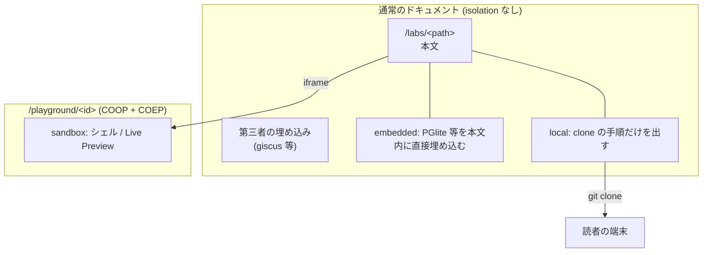

# Feature 設計: ハンズオンと Interactive

全体像は [design/DesignDoc.md](../../DesignDoc.md)、横断規約は [context/](../../../context/) を参照する。
判断の理由は [ADR-0006](../../../adr/0006-interactive-content-levels.md)。

## 背景・要件解釈

ハンズオンの価値の中心は「手を動かす」ことである。
読者が自分の環境を用意しないと再現できないコンテンツは、環境構築が重いテーマほど届かない。
成功条件 S4 は、実行環境のインストールを一切要求しないことを求める。

一方で、ブラウザ内実行を導入すると **cross-origin isolation という site 全体に及ぶ制約**が現れる。
この制約は、CORP を返さない第三者リソースを一律でブロックする。

ブラウザで再現できない題材もある。
ポートを開く、プロセスを分ける、ホストのリソースを測る。
これらを WASM で真似ると、確かめている対象そのものが失われる。

**本 feature の目的は、手を動かす場所を分離し、一部の場所が要求する制約が他を巻き込まないようにすることである。**

## スコープ

### やること

- ハンズオンの形式の定義
- 手順の導出と描画
- 手を動かす場所の 4 分類と `interactive` の型
- cross-origin isolation のパス分離
- 進捗の永続化

### やらないこと

- claat の導入。**使わない** (下記)
- 読者アカウントを前提とする進捗管理 → [ADR-0008](../../../adr/0008-no-reader-identity.md)
- `sandbox` の実装。**条件が成立するまで作らない**

## 設計

### ハンズオンの形式

**種別は 1 つである。** 読みながら手を動かす記事と、手順を踏破する教材を分けない。

| 要素   | 扱い                                                             |
| ------ | ---------------------------------------------------------------- |
| 形     | 1 画面 1 手順。全手順を 1 文書に入れ、CSS で 1 枚だけ出す        |
| 進捗   | 持つ。`localStorage` に手順単位で残す                            |
| 実行   | 本文中でコードが動く。題材が許さない場合は読者の端末で動かす     |
| layout | `LabLayout`。`SiteLayout` にサイドバーと 1 画面 1 手順の面を足す |

分けない理由は 2 つある。
種別を増やすと、著者が書く前に「これはどちらか」を判断させられる。
読者から見て違いが無い。
どちらも「読んで、手を動かして、進む」ページである。

`related` で記事と繋げば、読み物として書いたものから手を動かすページへ渡れる。
**種別ではなく関係で表す。**

### claat を使わない

Google Codelabs の `claat` は Markdown / Google Docs から静的 HTML を生成する Go 製 CLI である。**採らない。**

`claat` は独自の HTML と UI を吐くため、Content Model と Design System の外に出る。
一覧から参照できず、Design Tokens も効かない。**必要なのは `claat` の出力ではなく Codelab の形式**であり、それは描画レイヤとして自前で実装できる。

### Codelab 形式の実体

| 要素                                 | 実装                                                             |
| ------------------------------------ | ---------------------------------------------------------------- |
| 手順の分割                           | 本文の `h2` を手順の境界とし、ビルド時に見出しを走査して導出する |
| 手順ごとの所要時間                   | 見出し直後の `Duration: MM:SS` 行                                |
| 手順一覧 + 進捗バー + 現在地マーカー | ハンズオン専用 layout。手順は 1 ページに通しで並べる             |
| 完了状態の永続化                     | `localStorage`                                                   |
| 前後の移動                           | 本文の下の前後ボタン。端では `aria-disabled`                     |
| いま DB に何が入っているか           | サイドバーの一覧。行を押すと `<dialog>` に先頭 20 行を出す       |
| テーブル同士の関係                   | サイドバーの「テーブル構成」。`<dialog>` に ER 図を出す          |

**手順数を frontmatter に持たない。** 本文と手順数が乖離する経路をなくすためである ([content-model](../content-model/DesignDoc_content-model.md) の `handsOn` 拡張)。

**数える場所は 1 つにする。**
`remark-lab` が mdast の `h2` を数え、`remarkPluginFrontmatter.labSteps` で layout へ渡す。
`rehype-lab-steps` は同じ `h2` を 1 画面にまとめるだけで、数え直さない。
ページ側でも本文を再走査しない。
生の Markdown を正規表現で数えると、setext 見出しやフェンス内の `##` で AST 側とずれる。

**1 手順 1 画面にする。** 左のサイドバーで切り替え、下の前後ボタンで進む。
Google Codelabs (`claat`) と同じ形である。

**別 URL のページには割らない。** 全手順を 1 文書に入れ、CSS で 1 枚だけ出す。
ページを移ると実行環境が落ちるため、手順ごとに DB を作り直すことになる。
同一文書なら PGlite のインスタンスが生き残り、前の手順で作ったテーブルがそのまま残る。

URL は `#step-<N>` で表す。
`#step--1` が「はじめに」である。
`pushState` で積むので、ブラウザの戻る・進むが手順の行き来になる。

**手順の出し入れに React を使わない。** 属性の付け替えだけで足りる。
island にすると、実行環境を持たない `local` のハンズオンにも React を配ることになる。
`local` のページが配るのは切り替えの 1.5 KiB (gzip、2026-08-30 実測) だけである。

### 手を動かす場所の 4 分類

分ける軸は**読者がどこで実行するか**である。
frontmatter の `interactive.level` が 1 対 1 で対応する。

| `level`    | 実行するもの                             | cross-origin isolation    | 置き場                              |
| ---------- | ---------------------------------------- | ------------------------- | ----------------------------------- |
| (項目なし) | 実行しない。コードは表示のみ             | 不要                      | 本文                                |
| `embedded` | 単一ランタイムを WASM で埋め込む         | **不要**                  | 本文と同一ドキュメント              |
| `sandbox`  | プロジェクト一式 + シェル + Live Preview | **必要**                  | `/playground/<id>` の別ドキュメント |
| `local`    | ポートやプロセスを使う一式               | 不要 (こちらで実行しない) | 読者の端末                          |

**上下関係を持たせない。** `embedded` は `sandbox` の準備段階ではなく、それ自体で完結する。
`local` は下位の妥協ではなく、**ブラウザで再現できない題材の唯一の選択肢**である。

ページに置くものが `level` ごとに変わる。

| `level`    | 本文に出るもの     | サイドバー            | 配る JavaScript (gzip)      |
| ---------- | ------------------ | --------------------- | --------------------------- |
| `embedded` | 実行パネル         | 手順 + いまのテーブル | 61.6 KiB (React + 実行環境) |
| `sandbox`  | iframe             | 手順                  | 未実装                      |
| `local`    | clone と起動の手順 | 手順                  | **1.5 KiB** (切り替えのみ)  |

2026-08-30 実測。
`embedded` の 61.6 KiB に WASM は含まない。
WASM は実行ボタンを押すまで落とさない。

完了マーカーが付くのは**実行が成功した手順**と、**この読み込みのあいだに通り過ぎた手順**だけである。
`localStorage` を書き換えるだけで完了を捏造できないよう、現在地からは推し量らない。
`local` のハンズオンでは実行が起きないので、印は通り過ぎた分だけになる。

### cross-origin isolation の制約

`sandbox` の候補は `SharedArrayBuffer` を要求し、`COOP: same-origin` + `COEP: require-corp` が要る。**`COEP: require-corp` 下では CORP を返さないクロスオリジンのリソースがブロックされる。** 2026-08-26 に実測した。

| リソース                        | `cross-origin-resource-policy` | COEP 下            |
| ------------------------------- | ------------------------------ | ------------------ |
| `fonts.gstatic.com`             | `cross-origin`                 | 読める             |
| CORP を返さない第三者の埋め込み | なし                           | **ブロックされる** |

ブロックの対象は埋め込み `iframe`、外部の画像、埋め込み動画、外部ホストのスクリプトに及ぶ。

**isolation は取り消しの効かない方向の制約である。** サイト全体へ掛けると、第三者リソースを使いたくなるたびに、そのリソースが CORP を返すかどうかに実現可能性を握られる。
条件つきバックログの giscus が最初に当たる。

### 解決 — パス単位の分離



- `embedded` は本文と同一ドキュメントに置く。
  MDX 内にコンポーネントとして置ける
- `sandbox` は `/playground/<id>` の別ドキュメントに置き、本文からは `iframe` で埋め込む
- `local` は実行環境を持たない。
  リポジトリの URL と前提条件だけを持ち、コマンドを出す
- isolation は `apps/web/public/_headers` で `/playground/*` にのみ掛ける ([context/infrastructure.md](../../../context/infrastructure.md))。
  **`_headers` はまだ書いていない。** PGlite は素の Worker で動き `SharedArrayBuffer` を要求しないため、
  isolation を要求するランタイムが実在するまで掛けない

**この分離により、本文の描画と playground を持つかどうかが独立した判断になる。** `embedded` の埋め込みも `sandbox` の iframe も本文のレイアウトを変えずに実現できる。

### ランタイムの候補 (2026-08-26 時点の実測)

| ランタイム                    | version | license                                                    | isolation                     | `level`                |
| ----------------------------- | ------- | ---------------------------------------------------------- | ----------------------------- | ---------------------- |
| `@electric-sql/pglite`        | 0.5.8   | Apache-2.0                                                 | **不要** (実測)               | `embedded`             |
| `@sqlite.org/sqlite-wasm`     | 3.53.0  | Apache-2.0                                                 | VFS 実装による (未確認)       | `embedded`             |
| `@duckdb/duckdb-wasm`         | 1.33.1  | MIT                                                        | 単一スレッド版は不要 (未確認) | `embedded`             |
| `pyodide`                     | 314.0.6 | MPL-2.0                                                    | 不要                          | `embedded`             |
| `codemirror`                  | 6.0.2   | MIT                                                        | 不要                          | `embedded` / `sandbox` |
| `@codesandbox/sandpack-react` | 2.20.0  | Apache-2.0                                                 | バンドラのみなら不要 (未確認) | `sandbox`              |
| `@webcontainer/api`           | 1.6.4   | MIT (パッケージ)。**営利目的の本番利用には商用ライセンス** | **必要**                      | `sandbox`              |

**DB 系のハンズオンは PGlite を既定とする。**

**ただし配信量では SQLite が勝つ。** gzip で 0.53 MiB 対 5.28 MiB、Slow 4G の待ちが 29 秒から 3 秒台になる。
それでも PGlite を採るのは、**題材が Postgres のプランナの出力そのもの**だからである。
SQLite の `EXPLAIN QUERY PLAN` は cost 見積もりも `Buffers:` も `Planning Time` も返さず、想定コンテンツの 7 手順のうち 4 手順が成立しない。

**題材が Postgres 固有でなくなったら、この判断は覆る。** 汎用の SQL 入門なら SQLite を採る。 PGlite は Linux VM を使わず Postgres の単一ユーザーモードを WASM 化したもので、単一スレッド・単一接続のため `SharedArrayBuffer` を使わない。
gzip 後およそ 3.3 MB。

想定コンテンツ「RDBMS のクエリ実行を理解する」は **`embedded` に収まる。
ヘッダの変更も要らない。**

### `interactive` の型

`handsOn` の拡張として持つ。**`portalBase` には入れない** (記事が持つことはないため)。

```ts
const interactive = z.discriminatedUnion("level", [
  z.object({
    level: z.literal("embedded"),
    runtime: z.enum(["pglite"]),
  }),
  z.object({
    level: z.literal("local"),
    repository: z.string().url(),
    via: z.enum(["devcontainer", "docker-compose", "manual"]),
    requires: z.array(z.object({ name: z.string(), check: z.string().optional() })).default([]),
  }),
]);
```

判別可能 union にすることで、**`level` を足すときに既存のコンテンツへ影響が出ない。**
`level` ごとに要る項目が違うので、`repository` を持たない `embedded` に `repository` を書くとビルドが落ちる。

**実装済みの値だけを並べる。**
`runtime` に `sqlite` を先回りして受理すると、ビルドを通ったコンテンツが読者の押下で初めて失敗する。
`sandbox` の枝も、実装するときに足す。

初期化スクリプト (`setup`) は `interactive` の外、`handsOn` の直下に持つ。
`level` を変えても書き直さずに済むためである。

### サイドバー

| ページ     | サイドバーの中身            |
| ---------- | --------------------------- |
| ハンズオン | 手順の一覧 + いまのテーブル |
| playground | 試す + いまのテーブル       |

**他のハンズオンへの導線は置かない。**
読者が手順を追っているあいだ、別の記事の題は判断の材料にならない。
一覧へは本文上部のパンくずから戻る。

playground の「試す」はサイドバーに置く。
本文の側に置くと、結果の表と例が縦に並んで、どちらも幅を使えない。

サイドバーはたためる。
たたむと `--drawer-shut` (46px) まで縮み、開閉ボタンだけが残る。
開閉の状態は `localStorage` に置く。
この端末の都合であり、読者の identity を作らない ([ADR-0008](../../../adr/0008-no-reader-identity.md))。

「いまのテーブル」は**自分からは起動しない**。
実行パネルが 1 度でも走ったあとに、そのインスタンスへ問い合わせる。
ページを開いただけで 5 MiB を落とさないためである。

中身はサイドバーではなく `<dialog>` に出す。
306px の列に列を並べると日時が途中で切れ、値を読むという用を成さない。
`<dialog>` は top layer に出るので、サイドバーの `overflow` に切られない。

窓は 2 種類ある。

| 窓           | 中身                                |
| ------------ | ----------------------------------- |
| テーブルの窓 | 列の定義と、先頭 20 行              |
| テーブル構成 | ER 図。テーブルの箱と外部キーの向き |

**開いたままの窓は、実行のたびに中身を取得し直す。**
取得し直しはカタログへ問い合わせ直す。
サイドバーの一覧 (state) から組むと、実行の直後に古い姿のまま描いてしまう。

### 進捗の永続化

**`localStorage` に限る。** 読者の identity を前提とする機能を作らない ([ADR-0008](../../../adr/0008-no-reader-identity.md))。

```
key:   lab:<contentId>
value: { completedSteps: number[], lastStep: number }
```

**キーを `contentId` + 手順 index にする。** `path` は改名されうるため、改名で進捗が消えないようにする。

`localStorage` は端末をまたげない。**ハンズオンは 1 台で通すのが普通のため許容する。**

進捗が残ることを画面上で明示する ([design-system](../design-system/DesignDoc_design-system.md) の版面)。
読者は、何がどこに保存されたかを知らずに閉じることになる。

### コンポーネント構成 (C4 L3)

````mermaid
flowchart TD
    md["labs/*.md(x) (h2 = 手順)"] --> loader["Content Layer loader"]
    loader --> remark["remark-lab<br/>h2 を数え、```lang run を JSX へ"]
    remark -->|"remarkPluginFrontmatter.labSteps"| layout["LabLayout.astro"]
    remark --> rehype["rehype-lab-steps<br/>同じ h2 で section へまとめる"]
    rehype --> layout
    layout --> list["StepList.astro<br/>手順一覧 (静的)"]
    layout --> ctl["controller.ts<br/>画面の切り替え / 開閉 / 前後"]
    ctl --> ls["localStorage<br/>lab:&lt;contentId&gt;"]
    layout --> body["手順の画面 (1 枚だけ表示)"]
    body -.->|"embedded"| runner["SqlRunner.tsx"]
    pg["Playground.tsx"] --> hook
    runner --> hook["useRunner.ts<br/>実行の状態機械"]
    hook --> rt["runtime.ts<br/>Session / WORKERS / serialize"]
    rt --> w["pglite.worker.ts"]
    hook -.->|"lab:ran"| bus["bus.ts<br/>島をまたぐ通知"]
    preset["Presets.tsx"] -.->|"lab:preset"| bus
    bus -.-> pg
    bus -.-> peek["DbPeek.tsx"]
    peek --> cat["catalog.ts<br/>カタログの問い合わせ"]
    cat --> rt
    peek --> er["ErDiagram.tsx"]
    body -.->|"sandbox"| frame["iframe → /playground/&lt;id&gt;"]
    layout -.->|"local"| setup["LocalSetup.astro<br/>clone / 前提条件 / 起動"]
````

React Island になるのは**実行パネル・「いまのテーブル」・「試す」だけ**である。
手順の一覧・画面の切り替え・サイドバーの開閉は `controller.ts` が属性の付け替えで行う。
**ハンズオンと playground 以外のページには載らない。**

#### 島をまたぐ通知

実行パネルとサイドバーは別の React root なので、props でも context でも繋がらない。
唯一の共通の足場が `document` なので、CustomEvent を通す。

| 事象         | 送り手      | 受け手       | 用途                  |
| ------------ | ----------- | ------------ | --------------------- |
| `lab:ran`    | `useRunner` | `DbPeek`     | DB を取得し直す       |
| `lab:preset` | `Presets`   | `Playground` | 入力欄へ SQL を入れる |

**購読は `bus.ts` を通す。**
`addEventListener` を component に置くと、事象名と `contentId` の照合が使う側の数だけ重複する。

状態管理のライブラリを入れない。
購読は `useSyncExternalStore` を経由しても本数が減らず、流しているのは値ではなく合図である。

`rehype-lab-steps` を remark ではなく rehype に置くのは、
remark で包むと `.mdx` は JSX、`.md` は生 HTML と 2 通りの書き分けが要るためである。
hast まで来れば拡張子の違いが消えて 1 通りで済む。

#### 実行環境を足す経路

`remark-lab.ts` の `RUNNERS` が、フェンスの言語から部品を探す表を持つ。

```ts
const RUNNERS: Record<string, Runner> = {
  sql: {
    name: "SqlRunner",
    path: "~/components/lab/SqlRunner",
    engine: "Postgres",
    kind: "pglite",
  },
};
```

engine を足す手順は 3 つである。

1. `pglite.worker.ts` と同じ `boot` / `exec` を持つ Worker を書き、`runtime.ts` の `WORKERS` に足す
2. `SqlRunner.tsx` と同じ props を取る部品を書く。実行の状態機械は `useRunner` を再利用する
3. `RUNNERS` に 1 行足す

**コンテンツ側の書き方は変わらない。** 著者はフェンスの言語を変えるだけである。

### 実行パネルは記事にも置ける

`remark-lab` は拡張子だけを見る。
`.mdx` で書いた記事にも `run` 付きのフェンスを置ける (2026-08-30 に実測)。

**言語の記事はこの形を採る。**
[codapi](https://codapi.org/try/postgres/) と同じ「読む → 実行する → 書き換える」を、記事の中で成立させる。

| 言語   | 実行環境                   | 状態                   |
| ------ | -------------------------- | ---------------------- |
| SQL    | PGlite                     | 済                     |
| Python | Pyodide                    | 未。WASM で完結する    |
| TS/JS  | Worker で直接              | 未。WASM も要らない    |
| Go     | TinyGo / Go の wasm target | 未。実行可能かは未確認 |

engine を足す手順は「実行環境を足す」と同じである。
記事側の書き方は変わらない。

## 主要シナリオ / フロー

### 読者がハンズオンでクエリを実行する (`embedded`)

1. `/labs/rdbms-query-execution` を開く。「はじめに」の画面が出る
2. サイドバーの手順を押すか、下の「次へ」で進む
3. その手順の埋め込みエディタに SQL が用意されている
4. 実行すると、ページ内の PGlite が本物の Postgres として `EXPLAIN ANALYZE` を返す
5. サイドバーの「いまのテーブル」が更新される。行を押すと中身が `<dialog>` に出る
6. 「テーブル構成」を押すと ER 図が出る。開いたまま実行すると、図も追従する
7. 読者は SQL を書き換えて再実行できる

**環境構築が不要で、ヘッダの制約も受けない。**
手順を移っても同じ文書のままなので、**インスタンスは落ちない**。

### 読者が手元に環境を作る (`local`)

1. `/labs/otel-collector-local` を開く
2. 本文の前に「手元で用意する」が出る。
   前提条件、`git clone`、起動コマンドがコピーボタン付きで並ぶ
3. 読者は自分の端末で Dev Container を開き、本文の手順を追う
4. サイドバーは手順の一覧だけを出す。
   完了の印は出さない

**ページは JavaScript を配らない。**

### 読者がハンズオンを中断して再開する

1. `/labs/<path>` の手順 4 まで進む
2. 離脱する
3. 同じ端末で再訪すると、手順 4 の画面から再開できる
4. **DB は初期状態に戻っている。** 保存先がメモリのためである。
   次の実行で、完了済みの手順の SQL を順に流し直してから走る
5. **別の端末では最初からになる。** 許容する

## テスト観点

横断規約は [context/testing.md](../../../context/testing.md)。

- **手順の導出 (`remark-lab`) と画面へのまとめ (`rehype-lab-steps`) にテストを置く。** どちらも壊れても画面は出るため、目視では見つからない。
  `Duration:` の有無、`h2` が 0 個、フェンス内の `##`、`.md` に `run` を書いた場合を踏む
- 進捗 (`progress.ts`) は `localStorage` を差し替えて、読めない・書けない・壊れた JSON の 3 経路を踏む
- `localStorage` へのアクセスは try/catch で囲む。**プライベートウィンドウや設定でブロックされる環境で例外を投げるため、進捗が読めなくてもページが壊れないこと**を確認する
- `_headers` の変更時は、`/playground/*` の外へ isolation が漏れていないことを確認する。**誤って全体へ広げると第三者の埋め込みが一律で壊れる**

## 未決事項

| #   | 論点                                                                             | 期限                   | 状態                                                                                                                         |
| --- | -------------------------------------------------------------------------------- | ---------------------- | ---------------------------------------------------------------------------------------------------------------------------- |
| 1   | ~~`@sqlite.org/sqlite-wasm` の OPFS VFS が cross-origin isolation を要求するか~~ | —                      | **解決。** `"opfs"` VFS は `SharedArrayBuffer` と `Atomics` を要求するため COOP + COEP が要る。`opfs-sahpool` とメモリは不要 |
| 2   | WebContainers の商用ライセンス条件に本サイトが該当するか                         | `sandbox` を検討する時 | 未決。該当するなら Sandpack (Apache-2.0) を採る                                                                              |
| 3   | Sandpack の Node ランタイムが isolation を要求するか                             | `sandbox` を検討する時 | 未確認。バンドラのみなら不要                                                                                                 |
| 4   | ~~`Duration:` 行を本文に書くか frontmatter に書くか~~                            | —                      | **解決。** 本文の見出し直後に書き、`remark-lab` が本文から除く                                                               |
| 5   | `sandbox` の結果をどう出すか                                                     | `sandbox` を実装する時 | 未決。端末の出力とプレビューの URL は表の形に合わないため、`SqlRunner` の系統を再利用しない                                  |

## 関連ドキュメント

- [design/DesignDoc.md](../../DesignDoc.md): 全体像
- [ADR-0006](../../../adr/0006-interactive-content-levels.md): 本 feature の判断の正本
- [ADR-0008](../../../adr/0008-no-reader-identity.md): 進捗を `localStorage` に限る決定
- [ADR-0001](../../../adr/0001-starlight-as-docs-renderer.md): 描画レイヤを自前で持つ決定
- [content-model](../content-model/DesignDoc_content-model.md): `interactive` と `handsOn` の schema
- [context/infrastructure.md](../../../context/infrastructure.md): `_headers` の扱い
- [context/architecture.md](../../../context/architecture.md): `/playground/*` の URL 予約
